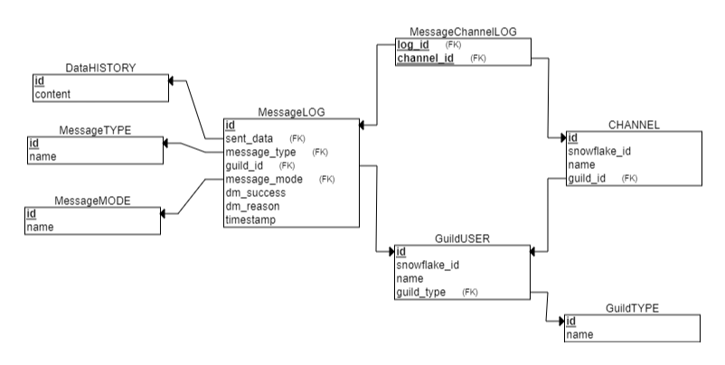

# **Discord Advertisement Framework (Bot)**

- [**Discord Advertisement Framework (Bot)**](#discord-advertisement-framework-bot)
  - [**Introduction**](#introduction)
  - [**Examples**](#examples)
- [**Compatability with Pycord (discord.py) API wrapper**](#compatability-with-pycord-discordpy-api-wrapper)
- [**Getting Started**](#getting-started)
  - [**Defining the server list**](#defining-the-server-list)
  - [**Starting the framework**](#starting-the-framework)
  - [**Obtaining account TOKEN**](#obtaining-account-token)
- [**Creatable objects**](#creatable-objects)
  - [framework.**LoggerSQL**](#frameworkloggersql)
    - [**Parameters**](#parameters)
  - [framework.**EMBED**](#frameworkembed)
    - [**Parameters**](#parameters-1)
    - [**Methods**](#methods)
  - [framework.**EmbedFIELD**](#frameworkembedfield)
    - [**Parameters**](#parameters-2)
  - [framework.**FILE**](#frameworkfile)
    - [**Parameters**](#parameters-3)
  - [framework.**AUDIO**](#frameworkaudio)
    - [**Parameters**](#parameters-4)
  - [framework.**GUILD**](#frameworkguild)
    - [**Parameters**](#parameters-5)
  - [framework.**USER**](#frameworkuser)
    - [**Parameters**](#parameters-6)
    - [**Example**](#example)
  - [framework.**xxxMESSAGE**](#frameworkxxxmessage)
    - [**xxxMESSAGE types**](#xxxmessage-types)
    - [**Common parameters**](#common-parameters)
  - [framework.**TextMESSAGE**](#frameworktextmessage)
    - [**Parameters**](#parameters-7)
    - [**Example**](#example-1)
  - [framework.**DirectMESSAGE**](#frameworkdirectmessage)
    - [**Parameters**](#parameters-8)
    - [**Example**](#example-2)
  - [framework.**VoiceMESSAGE**](#frameworkvoicemessage)
    - [**Parameters**](#parameters-9)
    - [**Example**](#example-3)
- [**Functions**](#functions)
  - [framework.**run(...)**](#frameworkrun)
    - [**Parameters**](#parameters-10)
  - [framework.**get_client()**](#frameworkget_client)
    - [**Description**](#description)
  - [framework.**shutdown()**](#frameworkshutdown)
    - [**Description**](#description-1)
- [**Decorators**](#decorators)
  - [framework.**data_function**](#frameworkdata_function)
- [**Logging**](#logging)
- [**Relational Database Log**](#relational-database-log)
  - [**Usage**](#usage)
  - [**Features**](#features)
  - [**ER diagram of the logs**](#er-diagram-of-the-logs)
  - [**Tables**:](#tables)
- [**JSON File Log**](#json-file-log)
  - [**Example**](#example-4)
- [**Trace messages**](#trace-messages)

<br>
## **Introduction**
Welcome to the Discord Advertisement Framework.<br>
If you ever needed a tool that allows you to advertise by **automatically sending messages to discord channels (text, voice and direct messages)**, this is the tool for you.
It supports advertising to **multiple guilds at once**, where it can generate **message logs** for each of those guilds where you can easilly find out what messages were successfully sent and which failed (and why they failed).<br>
It allows you to automatically send messages in **custom time ranges** where those ranges can be either **fixed** or **randomized** after each sent message.<br>
You can send data like **normal text**, **embeds**, **files** (TextMESSAGE, DirectMESSAGE) or **audio file** for streaming to discord voice channels (VoiceMESSAGE) , where the data can even be **dynamic** by providing the framework with an **user defined function**.<br>

**Why is it called a framework?**<br>
The project named framework, because it allows you to create additional application layers on top of it by using an user defined function that returns dynamic content.<br>
For an example see [**Examples/Coffee example**](Examples/Additional%20Application%20Layer%20Example/Coffee).

The below documentation describes everything you need to start advertising, thank you for reading it.<br>
If you would like to start right away, you can skip to the [Getting Started](#getting-started) section or see [Examples](#examples).
<br>

## **Examples**
Because I believe reading documention can be a bit boring, I prepaired some examples in the Examples folder which should show everying you might want to do.<br>
Examples folder: [Examples folder](Examples).
<br>

# **Compatability with Pycord (discord.py) API wrapper**
This framework uses [**PYCORD**](https://docs.pycord.dev/en/master/) to function, which is a discord API wrapper written in python. <br>
Because of this it is very easy to use Pycord along side the framework.<br>
All you need to do to use Pycord is import the library from the framework and if you want to use the started client, call the framework.get_client() function
```py
import framework as fw
from framework import discord

async def main():
  embed = discord.Embed()  # Directly from Pycord 
  client = fw.get_client()  # Gets the client object
  for guild in client.guilds:
    for channel in guild.channels:
        print(channel.name)

fw.run(
  token="JSMXqAHWQHRnSHQHJNFMQIHGQHJWDASH134SJDHS2", # Example account token
  server_list=[...],
  user_callback=main
)

```

# **Getting Started**
This section tells you how to quickly setup everything and begin shilling. <br>

## **Defining the server list**
First you need to import the framework and define the server (GUILD/USER) list.
```py
import framework as fw

servers = [
    ...
]

```
The list should contain [**GUILD**](#frameworkguild) or/and [**USER**](#frameworkuser) objects. <br>
```py
import framework as fw

servers = [
  fw.GUILD(
    guild_id=snowflake_id_here,
    messages_to_send=[
      fw.TextMESSAGE(...),
      fw.TextMESSAGE(...),
      fw.VoiceMESSAGE(...)
    ],
    generate_log = True
  ),

  fw.USER(
    user_id=snowflake_id_here,
    messages_to_send=[
      fw.DirectMESSAGE(...),
      fw.DirectMESSAGE(...),
      fw.DirectMESSAGE(...)
    ],
    generate_log = True
  )
]
```
**For help with other parameters and more detailed description of what each parameter does,
see [**xxxMESSAGE**](#frameworkxxxmessage) and [**GUILD**](#frameworkguild), [**USER**](#frameworkuser)**

The list can also be defined automatically via the user callback function (see [**run()** function](#frameworkrun))
```py
import framework as fw

servers = []

async def main():
    cl = fw.get_client()    

    for guild in cl.guilds: # See Pycord API: https://docs.pycord.dev/en/master/api.html
        channels = []
        for channel in guild.text_channels:
            if "shill" in channel.name.lower(): # Creates a id list of channels that have "shill" in the name
                channels.append(channel.id)
        servers.append(                             # For each guild, adds a new object
            fw.GUILD(
                guild_id=guild.id,
                messages_to_send=[
                    # Sends "Buy the new shovel!"" every 60 seconds"
                    fw.TextMESSAGE(None, 60, "Buy the new shovel!", channels, "send", True)
                ],
                generate_log=True
            )
        )
```

## **Starting the framework**
After you've defined the server list, all you need to do now is start the framework
by running the [**run()**](#frameworkrun) function and the framework will be shilling.
```py
import framework as fw

servers = []

async def main():
    cl = fw.get_client()    

    for guild in cl.guilds: # See Pycord API: https://docs.pycord.dev/en/master/api.html
        channels = []
        for channel in guild.text_channels:
            if "shill" in channel.name.lower(): # Creates a id list of channels that have "shill" in the name
                channels.append(channel.id)
        servers.append(                             # For each guild, adds a new object
            fw.GUILD(
                guild_id=guild.id,
                messages_to_send=[
                    # Sends "Buy the new shovel!"" every 60 seconds"
                    fw.TextMESSAGE(None, 60, "Buy the new shovel!", channels, "send", True)
                ],
                generate_log=True
            )
        )

fw.run(
  token="YOUR_TOKEN_HERE",
  is_user=False,
  server_list=servers,
  user_callback=main
)
```
The [**run()**](#frameworkrun) function takes other parameters as well, for more details see [**framework.run()**](#frameworkrun).

## **Obtaining account TOKEN**
To obtain the token for a **BOT** account go to [Discord Developer Portal](https://discord.com/developers/applications), to your application -> bot and copy the token. <br>
To obtain the token for an **USER** account see [YouTube - obtaining user token](https://www.youtube.com/results?search_query=discord+user+account+token). 
If the token is for an **USER** account you also need to set `is_user` to `True` inside the [**framework.run()**](#frameworkrun) function.
<br>

#  **Creatable objects**
## framework.**LoggerSQL**
This class is used to create the SQL manager objects in case you want to use SQL based logging instead of file logging.
It is used as the *sql_manager* argument to the [framework.**run()**](#frameworkrun) function.<br>

**\*NOTE:** The database must already exist! However it can be completly empty, no need to manually create the schema.

For more details see [**Logging**](#logging).

### **Parameters**
- username: str   - username to login with
- password: str   - password to login with
- server ip/url: str - IP address or URL to the server
- database: str - Name of the database

```py
fw.run(...,
       sql_manager=fw.LoggerSQL("david", "cooldude", "mysupersecretserver.com", "my_database"),
       ...)
```


## framework.**EMBED**

| **NOTE**<br>                                                       |
| ------------------------------------------------------------------ |
| This is only available to use if running on a **bot account**.<br> |
<br>

The **EMBED** class is an inherited class from discord.Embed meaning it has the same methods as [discord.Embed](https://docs.pycord.dev/en/master/api.html?highlight=discord%20embed#discord.Embed) but you can create a full embed without actually having to call those methods. 
  
### **Parameters**
- Inherited from discord.Embed:
  - For original parameters see [discord.Embed](https://docs.pycord.dev/en/master/api.html?highlight=discord%20embed#discord.Embed)

- Additional:
    - Author name (author_name) - Name of the author
    - Author icon (author_icon) - URL to author's icon
    - Author image(image)       - URL to an image (placed at the bottom)
    - Thumbnail (thumbnail)     - URL for a thumbnail (placed top right)
    - Fields (fields)           - list of [EmbedFIELD](#frameworkembed_field) objects   

### **Methods**
  - ```py
    EMBED.from_discord_embed(
                                _object: discord.Embed
                            )
    ```
      - **Info:** The method converts a **discord.Embed** object into a **framework.EMBED object**
      - **Parameters** 
        - _object : discord.Embed = object to convert
<br>

## framework.**EmbedFIELD**
| **NOTE**<br>                                                       |
| ------------------------------------------------------------------ |
| This is only available to use if running on a **bot account**.<br> |
<br>

The **EmbedFIELD** is used with combination of [framework.**EMBED**:](#frameworkembed) as one of it's parameters that represents one of the fields inside the embedded message.

### **Parameters**
- Field name (name)         : str  -  Name of the field
- Field content (content)   : str  -  Text that is placed inside the embedded field
- Inline (inline)           : bool -  If True and the previous or next embed field also have inline set to true, it will place this field in the same line as the previous or next field
<br>

## framework.**FILE**
The **FILE** objects represents a file you want to send to discord. 

### **Parameters**
- File name (filename)  - path to the file you want to send to discord
<br>

## framework.**AUDIO**
The **AUDIO** parameter represents an audio stream, you want streamed into a voice channel.

### **Parameters**
- File name (filename)  - path to the audio file you want to stream to discord
<br>

## framework.**GUILD**
The **GUILD** object represents a server to which messages will be sent.

### **Parameters**
- **guild_id** - identificator which can be obtain by enabling [developer mode](https://techswift.org/2020/09/17/how-to-enable-developer-mode-in-discord/) in discord's settings and afterwards right-clicking on the server/guild icon in the server list and clicking **"Copy ID"**,
- **messages_to_send** - List of [**TextMESSAGE**](#frameworktextmessage) and/or [**VoiceMESSAGE**](#frameworkvoicemessage)  objects
- **generate_log** - bool variable, if True it will generate a file log for each message send attempt.
```py
framework.GUILD(

        guild_id=123456789,         ## ID of server (guild)
        messages_to_send=[          ## List xxxMESSAGE objects 
            framework.TextMESSAGE(...),  
            framework.VoiceMESSAGE(...),  
            framework.TextMESSAGE(...),  
            framework.VoiceMESSAGE(...),
            ...
        ],
        generate_log=True           ## Generate file log of sent messages (and failed attempts) for this server 
        )
```
<br>

## framework.**USER**
The **USER** object represents a user to which **direct messages** will be sent.

### **Parameters**
- **user_id** - identificator which can be obtain by enabling [developer mode](https://techswift.org/2020/09/17/how-to-enable-developer-mode-in-discord/) in discord's settings and afterwards right-clicking on the server/guild icon in the server list and clicking **"Copy ID"**,
- **messages_to_send** - List of [**DirectMESSAGE**](#frameworkdirectmessage) objects
- **generate_log** - bool variable, if True it will generate a file log for each message send attempt.

### **Example**
```py
framework.USER(

        user_id=123456789,                  ## ID of the user 
        messages_to_send=[                  ## List DirectMESSAGE objects 
            framework.DirectMESSAGE(...),
            framework.DirectMESSAGE(...),
            ...
        ],
        generate_log=True                   ## Generate file log of sent messages (and failed attempts) for this server 
        )
```
<br>

## framework.**xxxMESSAGE**
### **xxxMESSAGE types**
The framework has 3 types of MESSAGE objects:
- [**Text**MESSAGE](#frameworktextmessage)
- [**Direct**MESSAGE](#frameworkdirectmessage)
- [**Voice**MESSAGE](#frameworkvoicemessage)

, where the **Text**MESSAGE and **Direct**MESSAGE are very simillar with the difference being **Direct**MESSAGE is for direct messages (DMs).

### **Common parameters**
Since all the classes inherit the **Base**MESSAGE class, they share certain parameters:
- **start_period** and **end_period**: `int` - The parameters specify the period on which framework will
try to send messages and also (if you are using the [data_function](#frameworkdatafunction)), the period on which your data function wil be called.
    - **start_period** can be one of the 2:
        - **Integer >= 0**: the period will be randomly choosen between **start_period** and **end_period**, and it is randomized after each send attempt.
        - **None**: The sending period will be equal to the **end_period**

- data: `message type dependant` - The data parameter describes the data that will be sent to Dicord, <br>
this is more detaily defined in the inherited classes.
- start_now: `bool` - This parameter dictates if the message should be sent as soon as the framework is ran or wait the period first.

## framework.**TextMESSAGE**
The **Text**MESSAGE class represents a message that will be sent into **text channels**.

### **Parameters**
Additionaly to the [common parameters](#common-parameters) the **Text**MESSAGE accepts the following parameters:
- **data** - The data parameter is the actual data that will be sent using discord's API. The **data types** of this parameter can be: 
     -  **str** (normal text),
     - [framework.**EMBED**](#frameworkembed),
     - [framework.**FILE**](#frameworkfile),
     - **list/tuple** containing the above listed types (maximum 1 str, 1 embed and up to 10 files)
     - **Function** defined by the user:
        <a id=text_msg_param_function></a>
        - Parameters: The function is allowed to accept anything
        - Return: The function **must** return any of the **above data types** or the **None** object if no data is ready to be sent.<br>
        If **None** is returned by the function, the framework will skip the send attempt and retry after it's **configured period**. For example you could make the framework call your function on more regular intervals and then decide within the function if anything is to be returned and if nothing is to be returned, you would return None.
        - **IMPORANT:** if you decide to use an user defined function as the data parameter, you **MUST** use the [framework.**data_function**](#frameworkdatafunction) decorator on it.
        When you pass the function to the data parameter, pass it in the next format:
           
            | **NOTE 1**:                                                                                                                                                                                                                                                                                                                                                                                                                       |
            | --------------------------------------------------------------------------------------------------------------------------------------------------------------------------------------------------------------------------------------------------------------------------------------------------------------------------------------------------------------------------------------------------------------------------------- |
            | When you use the framework.data_function decorator on the function, it returns a special class that is used by the framework to get data,<br> so consider making another function with the same definition and a different name or consider making this function to retreive data only.<br> Because the decorator returns a class and assigns it to the function name, you can no longer use this function as a regular function, |
                                    
            | **NOTE 2**:                                                                                                                                                                           |
            | ------------------------------------------------------------------------------------------------------------------------------------------------------------------------------------- |
            | If you don't use the **framework.data_function** decorator, the function will only get called once(when you pass it to the data) and will not be called by the framework dynamically. |
        - Usage:
            ```py
            @framework.data_function # <- IMPORTANT!!!
            def function_name(parameter_1, parameter_2):
                """
                Info: Function returns a different string each time when called by the framework making the sent data dynamic.
                """
                return f"Parameter: {parameter_1}\nTimestamp: {datetime.datetime.now()}"
            
            framework.TextMESSAGE(...,
                            data=function_name(parameter_1, parameter_2),
                            ...)    
            ```

- **channel_ids** - List of IDs of all the channels you want data to be sent into.
- **mode**   - string variable that defines the way message will be sent to a channel.<br>
  This parameter can be:
  - "send"  - Each period a new message will be sent to a channel,
  - "edit"  - The previous message will be edited or a new sent if it doesn't exist,
  - "clear-send" - Previous message sent to a channel will be deleted and then a new message will be sent.<br><br>

### **Example**
```py
framework.TextMESSAGE(
                start_period=None,              # If None, messages will be send on a fixed period (end period)
                end_period=15,                  # If start_period is None, it dictates the fixed sending period,
                                                # If start period is defined, it dictates the maximum limit of randomized period
                data= ["Some Text",
                       framework.EMBED(...),
                       framework.FILE("file.txt")    ],               # Data yo you want sent to the function (Can be of types : str, embed, file, list of types to the left
                                                # or function that returns any of above types(or returns None if you don't have any data to send yet), 
                                                # where if you pass a function you need to use the framework.data_function decorator on top of it ).
                channel_ids=[123456789],        # List of ids of all the channels you want this message to be sent into
                mode="send",                    # New message will be sent each period (can also be "edit" to edit previous message in channel or "clear-send" to delete old message and then send a new message)
                start_now=True                  # Start sending now (True) or wait until period
                ),  
```
<br>

## framework.**DirectMESSAGE**
The **Direct**MESSAGE represents a message that is sent into direct messages of an user. It used with USER class as the **messages_to_send** parameter.<br>
Apart from being sent into direct messages it is very simillar to the [framework.**TextMESSAGE**](#frameworktextmessage).

### **Parameters**
Additionally to the [common parameters](#common-parameters) the **Direct**MESSAGE accepts the following parameters:
- data - This is exactly the same as the data parameter for the [**Text**MESSAGE parameters](#frameworktextmessage), please refer to it's parameters section.
- mode - This is exactly the same as the data parameter for the [**Text**MESSAGE parameters](#frameworktextmessage), please refer to it's parameters section.

### **Example**
```py
framework.USER(
        user_id=123456789,                                  # ID of server (guild)
        messages_to_send=[                                  # List MESSAGE objects
            framework.DirectMESSAGE(
                                    start_period=None,      # If None, messages will be send on a fixed period (end period)
                                    end_period=15,          # If start_period is None, it dictates the fixed sending period,
                                                            # If start period is defined, it dictates the maximum limit of randomized period
                                    data=["Hello World",    # Data you want to sent to the function (Can be of types : str, embed, file, list of types to the left
                                        l_file1,            # or function that returns any of above types(or returns None if you don't have any data to send yet),
                                        l_file2,            # where if you pass a function you need to use the framework.FUNCTION decorator on top of it ).
                                        l_embed],           
                                    mode="send",            # "send" will send a new message every time, "edit" will edit the previous message, "clear-send" will delete
                                                            # the previous message and then send a new one
                                    start_now=True          # Start sending now (True) or wait until period
                                   ),  
        ],
        generate_log=True                                   ## Generate file log of sent messages (and failed attempts) for this user 
```
<br><br>

## framework.**VoiceMESSAGE**
The **Voice**MESSAGE represents a message that will be **streamed** into an audio channel.
| **NOTE 1**                                                                                                |
| --------------------------------------------------------------------------------------------------------- |
| **VoiceMESSAGE** requires  [**FFMPEG**](https://www.ffmpeg.org/) installed and added to **PATH** to work. |

| **NOTE 2**                                                                                                                                                          |
| ------------------------------------------------------------------------------------------------------------------------------------------------------------------- |
| The period for VoiceMESSAGE dictates the period of CONNECTING.                                                                                                      |
| If your period is 10 second and your audio file is 5 seconds long, then the between messages will be 5 seconds and time between connecting to VC will be 10 seconds |

### **Parameters**
Additionally to the [common parameters](#common-parameters) the **Voice**MESSAGE accepts the following parameters:
- **channel_ids** - List of IDs of all the channels you want data to be sent into.
- data - this parameter represents the data that is actually send to Discord. It can be:
  - [framework.**AUDIO**](#frameworkaudio) - This class represents an audio file that is going to be streamed.
  - **list** containing one audio file, if more are given, only the last is considered. This is allowed only for analogity with the TextMESSAGE and DirectMESSAGE data parameters.
  - **Function** defined by the user:
    - Return: The function **must** return any of the **above data types** or the **None** object if no data is ready to be sent.<br>
    - Other rules here are the same as in [framework.**TextMESSAGE** function parameter](#text_msg_param_function)

### **Example**
```py
framework.VoiceMESSAGE(
                start_period=None,                          # If None, messages will be send on a fixed period (end period)
                end_period=15,                              # If start_period is None, it dictates the fixed streaming period (period of channel join).,
                data=[framework.AUDIO("rick.mp3")],         # Data you want to send (Can be of types : AUDIO or function that returns any of above types [or returns None if you don't have any data to send yet])
                    
                channel_ids=[12345],
                start_now=True
            )
```

# **Functions**
## framework.**run(...)** 
### **Parameters**
- token             : str       - access token for account
- server_list       : list      - List of [framework.GUILD](#frameworkguild) objects
- is_user           : bool      - Set to True if token is from an user account and not a bot account
- user_callback     : function  - User callback async function (gets called after framework is ran, but before initialization of any objects)
- server_log_output : str       - Path where the server log files will be created (in case SQL logging is not used)
- sql_manager       : [LoggerSQL](#frameworkloggersql) - SQL controller object used to save logs into the database
- debug             : bool      - Print trace message to the console,
                                  usefull for debugging if you feel like something is not working
```py
framework.run(  token="your_token_here",                # MANDATORY
                server_list = [framework.GUILD(...),    # MANDATORY
                                framework.GUILD(...)],
                is_user=False,                          # OPTIONAL
                user_callback=None,                     # OPTIONAL
                server_log_output="History"             # OPTIONAL,
                sql_manager=framework.LoggerSQL(...),   # OPTIONAL,
                debug=True)                             # OPTIONAL
``` 
<br>

## framework.**get_client()**
### **Description**
The framework.**get_client** returns an object which is used to interact with Discord using their API. <br>
You can call this function to get the internal Client object instead of making a new Client objects.<br>
See more here: **[discord.Client](https://docs.pycord.dev/en/master/api.html?highlight=client#discord.Client)**.
<br>

## framework.**shutdown()**
### **Description**
The framework.**shutdown()** functions accepts no parameters and returns None.<br>
It is used to fully shutdown the framework and then **exit** out of the program.<br>


# **Decorators**
**Inside the framework**, there is only one decorator:

## framework.**data_function**

- This decorator accepts a function as it's parameter and then returns a object that will be called by the framework. To use an **user defined function as parameter** to the [framework.TextMESSAGE/framework.VoiceMESSAGE/DirectMESSAGE](#frameworkxxxmessage) data parameter, you **MUST** use this decorator beforehand. Please see the **Examples** folder.
- Usage:
    ```py
    import datetime
    import framework as fw

    ####################################################################################################
    @fw.data_function # <---- VERY IMPORTANT! If you don't do this, the function will only be called when you pass it to the data parameter
    def some_function(parameter1, parameter2):
        l_dt = datetime.datetime.now()
        return f"Good day! It is {l_dt.day}.{l_dt.month}.{l_dt.year}  {l_dt.hour}:{l_dt.minute}"

    @fw.data_function
    def some_other_function():
        audio_list  = ["Rickroll.mp3", "Careless_Whisper.mp3", ...]
        return fw.AUDIO( audio_list.pop(random.randrange(0, len(audio_list))) ) 
    ####################################################################################################

    servers = [
        fw.GUILD(
            guild_id=123456,
            messages_to_send=[
                fw.TextMESSAGE(
                            start_period=None,
                            end_period=1 * fw.C_DAY_TO_SECOND,
                            data=some_function(1234, 5678),
                            channel_ids= [21345, 23132, 2313223],
                            mode="send",
                            start_now=True
                            ),
                fw.VoiceMESSAGE(
                            start_period=None,
                            end_period=60,
                            data=some_other_function(),
                            channel_ids= [21345, 23132],
                            start_now=True
                            )
            ],
            generate_log=True
        ),
        fw.USER(
            user_id=123456789,
            messages_to_send=[
                fw.DirectMESSAGE(
                            start_period=None,
                            end_period=15,

                            data=["Hello World",
                                    l_file1,
                                    l_file2,
                                    l_embed],
                            mode="send",
                            start_now=True
                            ),  
                    ],
                    generate_log=True
                )
    ]

    ...
    ```
<br>

#  **Logging**
The framework allows to log sent messages for each GUILD/USER (if you set the "generate_log" to True inside the [**GUILD**](#frameworkguild) or [**USER**](#frameworkuser) object).
There are 2 different types of logs:
- [Relational database logs (MSSQL)](#relational-database-log)
- [JSON file logs](#json-file-log)
 
# **Relational Database Log**
This type of logging enables saving logs to a remote server inside the database. Currently **only Microsoft SQL server is supported.**<br>
In addition to being smaller in size, they are also easier to manage and view and proccess.

## **Usage**
To use a SQL base for logging, you need to pass the [**run()**](#frameworkrun) function with the
sql_manager parameter and pass it the [**LoggerSQL**](#frameworkloggersql) object.
```py
  import framework as fw
  
  ...

  fw.run(
    ...,
    sql_manager=fw.LoggerSQL("username", "password", "server_ip_url", "database_name")
  )
```

## **Features**
- Automatic creation of tables, procedures, functions, views, triggers
- Caching for faster logging
- Low redundancy for reduced file size
- Automatic error recovery:
  - Automatic reconnect on disconnect ~ Retries 3 times in delays of 5 minutes, then switches to file logging
  - If tables are deleted, they are automatically recreated
  - If cached values get corrupted, they are automatically recached
  - If there are other unhandable errors, the framework switches to file logging

**\*NOTE:** The database must already exist! However it can be completly empty, no need to manually create the schema.

## **ER diagram of the logs**


## **Tables**:
*(If the attribute is bold, it means it is a primary key).*
- MessageLOG: <a id="dbmessagelog"></a><br>
  This table contains the actual logs of sent messages, if the message type is **DirectMESSAGE**, then all the information is stored in this table.
  If the types are **Voice/Text**MESSAGE, then part of the log (to which channels it sent), is saved in the [**MessageChannelLOG**](#dbmessagechannellog) table.

  Attributes:
  - **id**: int ~ This is an internal identificator of the log inside the database.
  - sent_data: int ~ Foreign key pointing to a row inside the [**DataHISTORY**](#dbdatahistory) table.
  - message_type: int ~ Foreign key identificator pointing to a entry inside the [**MessageTYPE**](#dbmessagetype) table.
  - guild_id: int ~ (Internal id) Foreign key pointing to [**GuildUSER**](#dbguilduser) table
  - message_mode: int ~ Foreign key pointing to [**MessageMODE**](#dbmessagemode) table. This is non-null only for [**DirectMESSAGE**](#frameworkdirectmessage) and [**TextMESSAGE**](#frameworktextmessage)
  - dm_success: bit ~ Only for [**DirectMESSAGE**](#frameworkdirectmessage). This is set to 1 if the sent attempt was **successful** or 0 if the sent attempt was **unsuccessful**
  - dM_reason: str ~  This not null only if **dm_success** is set to 0, in that case it contains the string representation of the error that caused the message send attempt to be unsuccessful.
  - timestamp: datetime ~ The timestamp of the message send attempt.
  
  <br>
- DatHISTORY: <a id="dbdatahistory"></a> <br>
  This table contains all the **different** data that was ever advertised. Every element is **unique** and is not replicated.
  This table exist to reduce reduncancy and file size of the logs whenever same data is advertised multiple times.
  When a log is created, it is first checked if the data sent was already sent before, if it was the id to the existing DataHISTORY row is used,
  else a new row is created.
  
  Attributes:
  - **id**: int ~ Internal identificator of data inside the database.
  - content: str ~ Actual data that was sent.

  <br>
- MessageTYPE: <a id="dbmessagetype"></a> <br>
  This is a lookup table containing the the different message types that exist within the framework (xMESSAGE).
  
  Attributes:
  - **id**: int ~ Internal identificator of the message type inside the database.
  - name: str ~ The name of the actual message type.

  <br>
- GuildUSER: <a id="dbguilduser"></a> <br>
  The table contains all the guilds/users the framework ever generated a log for.

  Attributes:
  - **id**: int ~ Internal identificator of the Guild/User inside the database.
  - snowflake_id: int ~ The discord (snowflake) identificator of the User/Guild
  - name: str ~ Name of the Guild/User
  - guild_type: int ~ Foreign key pointing to [**GuildTYPE**](#dbguildtype) table.
 
  <br>
- MessageMODE: <a id="dbmessagemode"></a> <br>
  This is a lookup table containing the the different message modes available by **Text/Direct**MESSAGE, it is set to null for **Voice**MESSAGE.
  
  Attributes:
  - **id**: int ~ Internal identificator of the message mode inside the database.
  - name: str ~ The name of the actual message mode.

  <br>
- GuildTYPE: <a id="dbguildtype"></a> <br>
  This is a lookup table containing types of the guilds inside the framework (xGUILD).

  Attributes:
  - **id**: int ~  Internal identificator of the guild type inside the database.
  - name: str ~ The name of the guild type.

  <br>
- CHANNEL: <a id="dbchannel"></a> <br>
  The table contains all the channels that the framework ever advertised into.

  Attributes:
  - **id**: int ~ Internal identificator of the channel inside the database
  - snowflake_id: int ~ The discord (snowflake) identificator representing specific channel
  - name: str ~ The name of the channel
  - guild_id: int ~ Foreign key pointing to a row inside the [GuildUSER](#dbguilduser) table. It points to a guild that the channel is part of.

  <br>
- MessageChannelLOG: <a id="dbmessagechannellog"></a> <br>
  Since messages can send into multiple channels, each MessageLOG has multiple channels which
  cannot be stored inside the [**MessageLOG**](#dbmessagelog) unless json was to be used.
  This is why this table exists. It contains channels of each [**MessageLOG**](#dbmessagelog).

  Attributes:
  - **log_id**: int ~ Foreign key pointing to a row inside [**MessageLOG**](#dbmessagelog) (to which log this channel log belongs to).
  - **channel_id**  ~ Foreign key pointing to a row inside the [**CHANNEL**](#dbchannel) table.


# **JSON File Log**
The logs are writen in the JSON format and saved into a .json file, that has the name of the guild or an user you were sending messages into.
The .json files are fragmantated by day and stored into folder "Year/Month/Day", this means that each day a new json file will be generated for that specific day for easier managing,
for example, if today is 13.07.2022, the log will be saved into the file that is located in 
```
History
└───2022
│   └───07
│       └───13
|           └─── #David's dungeon.json
```
The logs are saved in the following format (json keys):
- name  -- The display name of the guild or an user
- id    -- The discord's snowflake ID of the guild or the user
- type  -- The type of object that created this log ([GUILD](#frameworkguild) or [USER](#frameworkuser))
- message_history   -- A list of all the message logs, this is depandant on the type of [**xxxMESSAGE**](#frameworkxxxmessage):
  - for **TextMESSAGE**:
    - sent_data -- contains the information about the sent data, can contain (the following keys are only present if that type of data was sent):
      - sent_text -- the text that was sent
      - sent_embed -- The embed that was sent, can contain the following (it only contains certain item if it was specified in the embed):
        - title
        - author
        - thumbnail
        - image
        - description
        - color
        - fields -- list of the embedded fields, each field contains:
        	- inline -- bool variable that specifies if the field was inline with the prev. or next field
        	- name   -- name of the field
        	- content -- text inside the field body
      - sent_files -- List of paths to the sent files
    - channels -- dictionary of channels, contains:
      - successful -- list of channels that the message was successfuly sent to, contains:
        - name
        - id
      - failed  -- list of channels that the message failed to be sent to, contains:
        - name
        - id
        - reason
    - type  -- This is always TextMESSAGE
    - mode  -- The sending mode ("send", "edit", "clear-send")
    - index -- Index of the log, new items are added to the top of the list
    - timestamp -- The timestamp of the message

  - for **VoiceMESSAGE**:
    - streamed_audio -- The audio file that was streamed to the channels
    - channels -- dictionary of channels, contains:
      - successful -- list of channels that the message was successfuly sent to, contains:
        - name
        - id
      - failed  -- list of channels that the message failed to be sent to, contains:
        - name
        - id
        - reason
    - type  -- This is always VoiceMESSAGE
    - index -- Index of the log, new items are added to the top of the list
    - timestamp -- The timestamp of the message

  - for **DirectMESSAGE**:
    - sent_data -- contains the information about the sent data, can contain (the following keys are only present if that type of data was sent):
      - This is exactly the same as in **TextMESSAGE**
    - success_info -- dictionary containing:
      - success -- bool variable that signals that sending was successful
      - reason -- [only present if success is false] The reason why sending failed
    - type  -- This is always DirectMESSAGE
    - mode  -- The sending mode ("send", "edit", "clear-send")
    - index -- Index of the log, new items are added to the top of the list
    - timestamp -- The timestamp of the message

## **Example**
```json
{
    "name": "\\David's dungeon",
    "id": 863071397207212052,
    "type": "GUILD",
    "message_history": [
        {
            "sent_data": {
                "text": "First message"
            },
            "channels": {
                "successful": [
                    {
                        "name": "spam",
                        "id": 964251195168423999
                    }
                ],
                "failed": []
            },
            "type": "TextMESSAGE",
            "mode": "send",
            "index": 3,
            "timestamp": "18.04.2022 13:07:12"
        },
        {
            "sent_data": {
                "text": "First message"
            },
            "channels": {
                "successful": [
                    {
                        "name": "spam",
                        "id": 964251195168423999
                    }
                ],
                "failed": []
            },
            "type": "TextMESSAGE",
            "mode": "send",
            "index": 2,
            "timestamp": "18.04.2022 13:07:07"
        },
        {
            "sent_data": {
                "text": "First message"
            },
            "channels": {
                "successful": [
                    {
                        "name": "spam",
                        "id": 964251195168423999
                    }
                ],
                "failed": []
            },
            "type": "TextMESSAGE",
            "mode": "send",
            "index": 1,
            "timestamp": "18.04.2022 13:07:02"
        },
        {
            "sent_data": {
                "text": "First message"
            },
            "channels": {
                "successful": [
                    {
                        "name": "spam",
                        "id": 964251195168423999
                    }
                ],
                "failed": []
            },
            "type": "TextMESSAGE",
            "mode": "send",
            "index": 0,
            "timestamp": "18.04.2022 13:06:57"
        }
    ]
}
```

# **Trace messages**
In case you feel like the framework is not doing it's job properly, eg. you feel like some messages aren't being send or the framework just stops without advertising, the framework offers **console logging** of **trace** messages. Trace messages can be **informative** (eg. which account is logged in), they can be **warnings** (eg. some channels could not be found),<br>
or they can be **errors**. <br>
Most of the trace messages won't stop the framework but will only removed the failed objects and print it to the console, becase you could, eg. get kicked from a server resulting in some channels<br>
not being found.<br><br>
To **enable** trace messages, set the **debug** option to True inside the **[framework.run](#frameworkrun)** function.
