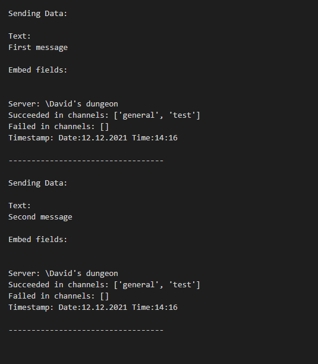

# <font size=8>**Shilling Framework Documentation**</font>
The shilling framework allows you to periodically (absolute or in a random time range)  send messages to discord servers and channels.
It supports sending normal text or even embeds(you are required to run on an actual bot) and can even accept user defined functions that will be called to get the data you want to send. 
The framework also supports formatted logging which tells you what messages succeeded in which channels and failed in which channels(and why they failed).

The below documentation describes everything you need to start shilling, thank you for reading it. If you don't like to read you can skip to the [Getting Started](#getting_started) section.
***
## <font size=5> **Framework creatable objects** </font>:

- **GUILD**:
    - The **GUILD** object represents a server to which messages will be sent.
    - <u>Parameters</u>:
        - **Guild ID** - identificator which can be obtain by enabling [developer mode (a.k.a application test mode)](https://discord.com/developers/docs/game-sdk/store) in discord's settings and afterwards right-clicking on the server/guild icon in the server list and clicking **"Copy ID"**,
        - **List of <u>MESSAGE</u> objects** - Python list or tuple contating **MESSAGE** objects.
    <br><br>
-  **MESSAGE** 
    - The **MESSAGE** object containts parameters which contain data that will be sent to the server/guild but also contains parameters that specify behaviour.
    - <u>Parameters</u>:
        - **Start Period** , **End Period** (start_period, end_period) - These 2 parameters specify the period on which the messages will be sent.
            - **Start Period** can be either:
              - None - Messages will be sent on intervals specified by **End period**,
              - Integer larger $\geq$ 0 - Messages will be sent on intervals **randomly** chosen between **<u>Start period** and **End period</u>**, where the randomly chosen intervals will be randomized after each sent message.<br><br>
        - **Data** (data) - The data parameter is the actual data that will be sent using discord's API. The **data types** of this parameter can be:
          - String (normal text),
          - [Embed](https://www.quora.com/What-are-embeds-on-Discord) ,
          - List containing: string or embed or (string and embed) - Order in list does not matter,
          - **Function** that accepts no parameters and returns any of the **above** three data types.<br><br>
        - **Channel IDs** (channel_ids) - List of IDs of all the channels you want data to be sent into.
        - **Clear Previous** (clear_previous) - A bool variable that can be either True of False. If True, then before sending a new message to the channels, the framework will delete all previous messages sent to discord that originated from this message object.
        - **Start Now** (start_now) - A bool variable that can be either True or False. If True, then the framework will send the message as soon as it is run and then wait it's period before trying again. If False, then the message will not be sent immediatly after framework is ready, but will instead wait for the period to elapse.
***
## <font size=5> **Functions** </font>:
The framework only gives you one function to call making it easy to use.
That function is **run**. The function only accepts one parameter  called user_callback which is a **function that will be called after the framework has been initialized**.
To access the function, use: **framework.run(user_callback function here)**
***
## <a id="getting_started"></a><font size=5>**Getting started**</font>:

### <u> Install requirements:</u>
The very first thing you need to do is install the requered modules which is discord. In the directory you will already see a discord folder, however this does not include it's requirements. The folder only containts slightly modified version of the discord.py API which will not block if a certain channel is in slow mode cooldown, but will skip the channel instead (it will be logged under failed channels if **logging** has been enabled in the [Configuration](Config.py)).

### <u> Configuration </u>
The framework can be configured in the [Config.py](Config.py) file. You only need to really change the [C_BOT_API_KEY](#DISCORD-TOKEN).

<u>Configuration variables</u>:
- <a id="DISCORD-TOKEN"></a>C_BOT_API_KEY - is the account authorization token, to obtain it for a **bot account**, go to [Discord's develeper portal](https://discord.com/developers/applications), select your application and go to Bot section and under Token click **Copy key**.<br>
To get it for an **user account** follow instructions: [INSTRUCTIONS](https://www.youtube.com/results?search_query=how+to+find+user+discord+token)

- C_IS_USER - Set this to true if you are trying to send messages from an user account
- C_DEBUG   - If True, it will print trace messages to the console
- C_DEBUG_FILE_OUTPUT - C_DEBUG needs to be True for this to be considered. If C_DEBUG_FILE_OUTPUT is True, it will print trace into a file, note that trace includes all trace messages, not just a log of what was sent to each server.
- C_SERVER_FILE_LOG - If True, the framework will generate files for each server and in those willes there is going to be a log of all the sent messages.<br>
<u>Example Image:</u><br>



### <u> Sending messages </u>

To start sending messages you must first create a python file, e.g <u>*main.py*</u> and import <u>**framework**</u>.


Then define the server list:
```py
framework.GUILD.server_list = [
]
```
and in that server list, define **GUILD** objects.
```py
framework.GUILD.server_list = [
    # GUILD 1
    framework.GUILD(
        123456789,       # ID of server (guild)
        [                # List MESSAGE objects 
            framework.MESSAGE(start_period=None, end_period=0, data="", channel_ids=[123456789, 123456789], clear_previous=False, start_now=True),
            framework.MESSAGE(start_period=None, end_period=0, data="", channel_ids=[123456789, 123456789], clear_previous=False, start_now=True),
        ]
    ),

    # GUILD 2
    framework.GUILD(
        123456789,       # ID of server (guild)
        [                # List MESSAGE objects 
            framework.MESSAGE(start_period=None, end_period=0, data="", channel_ids=[123456789, 123456789], clear_previous=False, start_now=True),
            framework.MESSAGE(start_period=None, end_period=0, data="", channel_ids=[123456789, 123456789], clear_previous=False, start_now=True),
        ]
    ),

    # GUILD n
    framework.GUILD(
        123456789,       # ID of server (guild)
        [                # List MESSAGE objects 
            framework.MESSAGE(start_period=None, end_period=0, data="", channel_ids=[123456789, 123456789], clear_previous=False, start_now=True),
            framework.MESSAGE(start_period=None, end_period=0, data="", channel_ids=[123456789, 123456789], clear_previous=False, start_now=True),
        ]
    )
]
```

Now start the framework by calling the **framework.run()** function. The function can accept one parameter which is a function to be called after framework has started.

```py

def callback():
    print("Framework is now running")

framework.run(user_callback=callback)

```

That's it, your framework is not running and messages will be periodicaly sent.