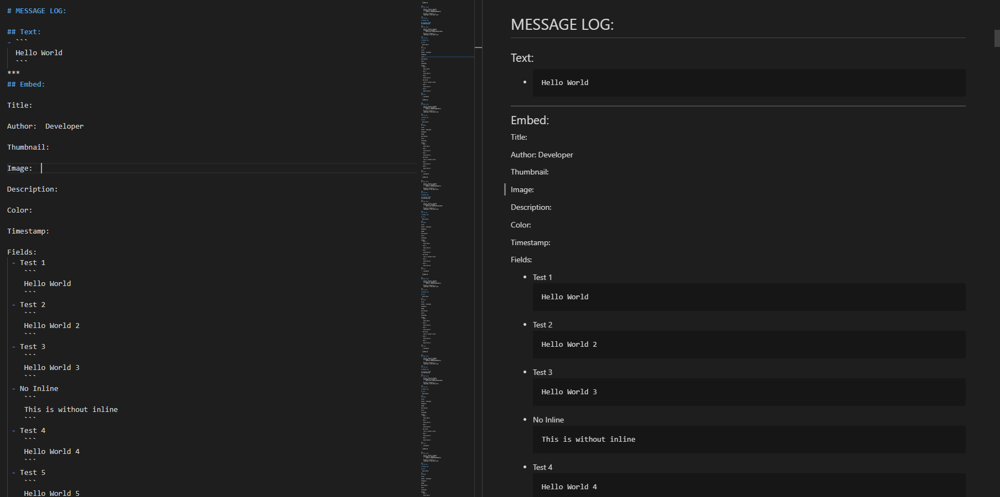
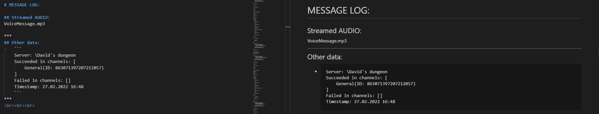

# **Discord Advertisement Framework (Bot)**
[](https://pepy.tech/project/discord-advert-framework) [](https://pepy.tech/project/discord-advert-framework)
[](https://pypi.org/project/Discord-Advert-Framework/)

## **Table of contents**
- [**Discord Advertisement Framework (Bot)**](#discord-advertisement-framework-bot)
  - [**Table of contents**](#table-of-contents)
  - [**Introduction**](#introduction)
  - [**Examples**](#examples)
- [**Getting started**](#getting-started)
  - [**Installation**](#installation)
  - [**Sending messages**](#sending-messages)
- [**Creatable objects**](#creatable-objects)
  - [framework.**EMBED**](#frameworkembed)
    - [**Parameters**](#parameters)
    - [**Methods**](#methods)
  - [framework.**EmbedFIELD**](#frameworkembedfield)
    - [**Parameters**](#parameters-1)
  - [framework.**FILE**](#frameworkfile)
    - [**Parameters**](#parameters-2)
  - [framework.**AUDIO**](#frameworkaudio)
    - [**Parameters**](#parameters-3)
  - [framework.**GUILD**](#frameworkguild)
    - [**Parameters**](#parameters-4)
  - [framework.**TextMESSAGE** / framework.**VoiceMESSAGE**](#frameworktextmessage--frameworkvoicemessage)
    - [**Parameters**](#parameters-5)
- [**Functions**](#functions)
  - [framework.**run(...)**](#frameworkrun)
    - [**Parameters**](#parameters-6)
  - [framework.**get_client()**](#frameworkget_client)
    - [Description](#description)
  - [framework.**shutdown()**](#frameworkshutdown)
    - [Description](#description-1)
- [**Decorators**](#decorators)
  - [framework.**data_function**](#frameworkdata_function)
- [**Logging**](#logging)
  - [**LOG OF SENT MESSAGES**](#log-of-sent-messages)
  - [**Trace messages**](#trace-messages)
- [**Regarding Pycord/discord.py**](#regarding-pycorddiscordpy)

<br>

## **Introduction**
Welcome to the Discord Advertisement Framework.<br>
If you ever needed a tool that allows you to advertise by **automatically sending messages to discord channels (text and voice)**, this is the tool for you.
It supports advertising to **multiple guilds at once**, where it can generate **message logs** for each of those guilds where you can easilly find out what messages were successfully sent and which failed (and why they failed).<br>
It allows you to automatically send messages in **custom time ranges** where those ranges can be either **fixed** or **randomized** after each sent message.<br>
You can send data like **normal text**, **embeds**, **files** (TextMESSAGE) or **audio file** for streaming to discord voice channels (VoiceMESSAGE) , where the data can even be **dynamic** by providing the framework with an user defined function.<br>

**Why is it called a framework?**<br>
The project named framework, because it allows you to create additional application layers on top of it by using an user defined function that returns dynamic content.<br>
For an example see [**Examples/Coffee example**](Examples/Additional%20Application%20Layer%20Example/Coffee).

The below documentation describes everything you need to start advertising, thank you for reading it.<br>
If you would like to start right away, you can skip to the [Getting Started](#getting-started) section or see [Examples](#examples).
<br>

## **Examples**
Because I believe reading documention can be a bit boring, I prepaired some examples in the Examples folder which should show everying you might want to do.<br>
Examples folder: [Examples folder](Examples).
<br>

# **Getting started**
## **Installation**
To install the framework use one of the following commands:
```fix
python3 -m pip install Discord-Advert-Framework
```
or
```fix
py -3 -m pip install Discord-Advert-Framework
```
<br>

##  **Sending messages**
To start sending messages you must first create a python file, e.g <u>*main.py*</u> and import <u>**framework**</u>.<br>
```py
import framework
```
Then define the server list and in that server list, define [**GUILD**](#frameworkguild) and [**TextMESSAGE / VoiceMESSAGE**](#frameworktextmessage--frameworkvoicemessage) objects:
```py
import framework as fw


servers = [
    fw.GUILD(
        guild_id=12456789,              
        messages_to_send = [
            fw.TextMESSAGE(
                ...
            ),
            fw.VoiceMESSAGE(
                ...
            )
        ],
        generate_log = True
    ),
    
    fw.GUILD(
        guild_id=12456789,
        messages_to_send = [
            fw.TextMESSAGE(
                ...
            ),
            fw.VoiceMESSAGE(
                ...
            )
        ],
        generate_log = True
    ),
    ...
]

```

Now start the framework by calling the [**framework.run()**](#frameworkrun) function.

```python
import framework as fw

servers = [
    ...
]


def callback():
    print("Framework is now running")

fw.run(  token="account token here",            # MANDATORY (This is the string that contains the account token, I suggest you define it in a secret.py)
                server_list=servers,            # MANDATORY -- List of GUILD objects
                is_user=False,                  # OPTIONAL -- Must be true if token is from an user account
                user_callback=callback,         # OPTIONAL -- Function that is called after framework is run
                server_log_output="History",    # OPTIONAL -- The path to the server log file outputs
                debug=True)                     # OPTIONAL -- For easiser debugging if you think your messages aren't being sent (will print trace to the console)

```
That's it, your framework is now running and messages will be periodicaly sent.<br>
For easier start, I recommend you take a look at the [Examples](Examples).<br><br>

For help with the object parameters see [**Creatable Objects**](#creatable-objects).
<br>

#  **Creatable objects**
## framework.**EMBED**

| **NOTE**<br>                                                       |
| ------------------------------------------------------------------ |
| This is only available to use if running on a **bot account**.<br> |
<br>

The **EMBED** class is an inherited class from discord.Embed meaning it has the same methods as [discord.Embed](https://docs.pycord.dev/en/master/api.html?highlight=discord%20embed#discord.Embed) but you can create a full embed without actually having to call those methods. 
  
### **Parameters**
- Inherited from discord.Embed:
  - For original parameters see [discord.Embed](https://docs.pycord.dev/en/master/api.html?highlight=discord%20embed#discord.Embed)

- Additional:
    - Author name (author_name) - Name of the author
    - Author icon (author_icon) - URL to author's icon
    - Author image(image)       - URL to an image (placed at the bottom)
    - Thumbnail (thumbnail)     - URL for a thumbnail (placed top right)
    - Fields (fields)           - list of [EmbedFIELD](#frameworkembed_field) objects   

### **Methods**
  - ```py
    EMBED.from_discord_embed(
                                _object: discord.Embed
                            )
    ```
      - **Info:** The method converts a **discord.Embed** object into a **framework.EMBED object**
      - **Parameters** 
        - _object : discord.Embed = object to convert
<br>

## framework.**EmbedFIELD**
| **NOTE**<br>                                                       |
| ------------------------------------------------------------------ |
| This is only available to use if running on a **bot account**.<br> |
<br>

The **EmbedFIELD** is used with combination of [framework.**EMBED**:](#frameworkembed) as one of it's parameters that represents one of the fields inside the embedded message.

### **Parameters**
- Field name (name)         : str  -  Name of the field
- Field content (content)   : str  -  Text that is placed inside the embedded field
- Inline (inline)           : bool -  If True and the previous or next embed field also have inline set to true, it will place this field in the same line as the previous or next field
<br>

## framework.**FILE**
The **FILE** objects represents a file you want to send to discord. 

### **Parameters**
- File name (filename)  - path to the file you want to send to discord
<br>

## framework.**AUDIO**
The **AUDIO** parameter represents an audio stream, you want streamed into a voice channel.

### **Parameters**
- File name (filename)  - path to the audio file you want to stream to discord
<br>

## framework.**GUILD**
The **GUILD** object represents a server to which messages will be sent.

### **Parameters**
- **Guild ID** - identificator which can be obtain by enabling [developer mode](https://techswift.org/2020/09/17/how-to-enable-developer-mode-in-discord/) in discord's settings and afterwards right-clicking on the server/guild icon in the server list and clicking **"Copy ID"**,
- **List of [TextMESSAGE/VoiceMESSAGE](#frameworktextmessage--frameworkvoicemessage) objects** - Python list or tuple contating **TextMESSAGE**/**VoiceMESSAGE** objects.
- **Generate file log** - bool variable, if True it will generate a file log for each message send attempt.
```py
GUILD(

        guild_id=123456789,         ## ID of server (guild)
        messages_to_send=[          ## List xxxMESSAGE objects 
            framework.TextMESSAGE(...),  
            framework.VoiceMESSAGE(...),  
            framework.TextMESSAGE(...),  
            framework.VoiceMESSAGE(...),
            ...
        ],
        generate_log=True           ## Generate file log of sent messages (and failed attempts) for this server 
        )
```
<br>

## framework.**TextMESSAGE** / framework.**VoiceMESSAGE**
The **TextMESSAGE** and **VoiceMESSAGE** object containts parameters which describe behaviour and data that will be sent to the channels. They are very similar where the TextMESSAGE object will send to text channels and VoiceMESSAGE will send to voice channels.

| **NOTE**                                                                                                  |
| --------------------------------------------------------------------------------------------------------- |
| **VoiceMESSAGE** requires  [**FFMPEG**](https://www.ffmpeg.org/) installed and added to **PATH** to work. |

### **Parameters**
-  **Start Period** , **End Period** (start_period, end_period) - These 2 parameters specify the period on which the messages will be sent.
    - **Start Period** can be either:
      - None - Messages will be sent on intervals specified by **End period**,
      - Integer  >= 0 - Messages will be sent on intervals **randomly** chosen between **<u>Start period** and **End period</u>**, where the randomly chosen intervals will be re-randomized after each sent message.
    
    | NOTE                                                                                                                                                                |
    | ------------------------------------------------------------------------------------------------------------------------------------------------------------------- |
    | The period for VoiceMESSAGE dictates the period of CONNECTING.                                                                                                      |
    | If your period is 10 second and your audio file is 5 seconds long, then the between messages will be 5 seconds and time between connecting to VC will be 10 seconds |
    <br>

-  **Data** (data) - The data parameter is the actual data that will be sent using discord's API. The **data types** of this parameter can be: 
   - for **TextMESSAGE**:
     -  **str** (normal text),
     - [framework.**EMBED**](#frameworkembed),
     - [framework.**FILE**](#frameworkfile),
   - for **VoiceMESSAGE**:
     - [framework.**AUDIO**](#frameworkaudio)
   - for **TextMESSAGE** and **VoiceMESSAGE**:
      - **list/tuple** containing the above listed types
      - **Function** defined by the user:
         - Parameters: The function is allowed to accept anything
         - Return: The function **must** return any of the **above data types** or the **None** object if no data is ready to be sent.<br>
         If **None** is returned by the function, the framework will skip the send attempt and retry after it's **configured period**. For example you could make the framework call your function on more regular intervals and then decide within the function if anything is to be returned and if nothing is to be returned, you would return None.
         - **IMPORANT:** if you decide to use an user defined function as the data parameter, you **MUST** use the [framework.**data_function**](#frameworkdatafunction) decorator on it.
           When you pass the function to the data parameter, pass it in the next format:
           ```py
           @framework.data_function # <- IMPORTANT!!!
           def function_name1(parameter_1, parameter_2):
               """
               Info: Function returns a different string each time when called by the framework making the sent data dynamic.
               """
               return f"Parameter: {parameter_1}\nTimestamp: {datetime.datetime.now()}"
            
           @framework.data_function # <- IMPORTANT!!!
           def function_name2(parameter_1, parameter_2):
               return framework.AUDIO("recording.mp3")


           framework.TextMESSAGE(...,
                           data=function_name1(parameter_1, parameter_2),
                           ...)

            framework.VoiceMESSAGE(...,
                           data=function_name2(parameter_1, parameter_2),
                           ...)                                                
           ```
           
           | **NOTE 1**:                                                                                                                                                                                                                                                                                                                                                                                                                       |
           | --------------------------------------------------------------------------------------------------------------------------------------------------------------------------------------------------------------------------------------------------------------------------------------------------------------------------------------------------------------------------------------------------------------------------------- |
           | When you use the framework.data_function decorator on the function, it returns a special class that is used by the framework to get data,<br> so consider making another function with the same definition and a different name or consider making this function to retreive data only.<br> Because the decorator returns a class and assigns it to the function name, you can no longer use this function as a regular function, |
                                   
           | **NOTE 2**:                                                                                                                                                                           |
           | ------------------------------------------------------------------------------------------------------------------------------------------------------------------------------------- |
           | If you don't use the **framework.data_function** decorator, the function will only get called once(when you pass it to the data) and will not be called by the framework dynamically. |

- **Channel IDs** (channel_ids) - List of IDs of all the channels you want data to be sent into.
- **Send mode** [only **TextMESSAGE**] (mode)  - string variable that defines the way message will be sent to a channel.<br>
  This parameter can be:
  - "send"  - Each period a new message will be sent to a channel,
  - "edit"  - The previous message will be edited or a new sent if it doesn't exist,
  
    | NOTE                                                                       |
    | -------------------------------------------------------------------------- |
    | Editing messages with files is not yet supported (files won't get updated) |
  - "clear-send" - Previous message sent to a channel will be deleted and then a new message will be sent.<br><br>
- **Start Now** (start_now) - A bool variable that can be either True or False. If True, then the framework will send the message as soon as it is run and then wait it's period before trying again. If False, then the message will not be sent immediatly after framework is ready, but will instead wait for the period to elapse.<br>
```py
framework.TextMESSAGE(
                start_period=None,              # If None, messages will be send on a fixed period (end period)
                end_period=15,                  # If start_period is None, it dictates the fixed sending period,
                                                # If start period is defined, it dictates the maximum limit of randomized period
                data= ["Some Text",
                       framework.EMBED(...),
                       framework.FILE("file.txt")    ],               # Data yo you want sent to the function (Can be of types : str, embed, file, list of types to the left
                                                # or function that returns any of above types(or returns None if you don't have any data to send yet), 
                                                # where if you pass a function you need to use the framework.data_function decorator on top of it ).
                channel_ids=[123456789],        # List of ids of all the channels you want this message to be sent into
                mode="send",                    # New message will be sent each period (can also be "edit" to edit previous message in channel or "clear-send" to delete old message and then send a new message)
                start_now=True                  # Start sending now (True) or wait until period
                ),  

framework.VoiceMESSAGE(
                start_period=None,              # If None, messages will be send on a fixed period (end period)
                end_period=15,                  # If start_period is None, it dictates the fixed sending period,
                                                # If start period is defined, it dictates the maximum limit of randomized period
                data=framework.AUDIO("a.mp3"),  # Data yo you want sent to the function (Can be of types : str, embed, file, list of types to the left
                                                # or function that returns any of above types(or returns None if you don't have any data to send yet), 
                                                # where if you pass a function you need to use the framework.data_function decorator on top of it ).
                channel_ids=[123456789],        # List of ids of all the channels you want this message to be sent into
                start_now=True                  # Start sending now (True) or wait until period
                ),  
```
<br>

# **Functions**
## framework.**run(...)** 
### **Parameters**
- token             : str       = access token for account
- server_list       : list      = List of [framework.GUILD](#frameworkguild) objects
- is_user           : bool      = Set to True if token is from an user account and not a bot account
- user_callback     : function  = User callback function (gets called after framework is ran)
- server_log_output : str       = Path where the server log files will be created
- debug             : bool      = Print trace message to the console,
                                    usefull for debugging if you feel like something is not working
```py
framework.run(  token="your_token_here",                # MANDATORY
                server_list = [framework.GUILD(...),    # MANDATORY
                                framework.GUILD(...)],
                is_user=False,                          # OPTIONAL
                user_callback=None,                     # OPTIONAL
                server_log_output="History"             # OPTIONAL
                debug=True)                             # OPTIONAL
``` 
<br>

## framework.**get_client()**
### Description
The framework.**get_client** returns an object which is used to interact with Discord using their API. <br>
You can call this function to get the internal Client object instead of making a new Client objects.<br>
See more here: **[discord.Client](https://docs.pycord.dev/en/master/api.html?highlight=client#discord.Client)**.
<br>

## framework.**shutdown()**
### Description
The framework.**shutdown()** functions accepts no parameters and returns None.<br>
It is used to fully shutdown the framework and then **exit** out of the program.<br>


# **Decorators**
Python decorators are callable objects that you can use to give your function or class extra functionallity. Essentialy they are meant to accept a function or a class as their parameter and then process whatever they are meant to do with the function or class.
More on Python decorators [here](https://realpython.com/primer-on-python-decorators/).<br>
**Inside the framework**, there is only one decorator:

## framework.**data_function**

- This decorator accepts a function as it's parameter and then returns a object that will be called by the framework. To use an <u>user defined function as parameter</u> to the [framework.TextMESSAGE/framework.VoiceMESSAGE](#frameworktextmessage--frameworkvoicemessage) data parameter, you **MUST** use this decorator beforehand. Please see the **Examples** folder.
- Usage:
    ```py
    import datetime
    import framework as fw

    ####################################################################################################
    @fw.data_function # <---- VERY IMPORTANT! If you don't do this, the function will only be called when you pass it to the data parameter
    def some_function(parameter1, parameter2):
        l_dt = datetime.datetime.now()
        return f"Good day! It is {l_dt.day}.{l_dt.month}.{l_dt.year}  {l_dt.hour}:{l_dt.minute}"

    @fw.data_function
    def some_other_function():
        audio_list  = ["Rickroll.mp3", "Careless_Whisper.mp3", ...]
        return fw.AUDIO( audio_list.pop(random.randrange(0, len(audio_list))) ) 
    ####################################################################################################

    servers = [
        fw.GUILD(
            guild_id=123456,
            messages_to_send=[
                fw.TextMESSAGE(
                            start_period=None,
                            end_period=1 * fw.C_DAY_TO_SECOND,
                            data=some_function(1234, 5678),
                            channel_ids= [21345, 23132, 2313223],
                            mode="send",
                            start_now=True
                          ),
                fw.VoiceMESSAGE(
                            start_period=None,
                            end_period=60,
                            data=some_other_function(),
                            channel_ids= [21345, 23132],
                            start_now=True
                          )
            ],
            generate_log=True
        )
    ]

    ...
    ```
<br>

#  **Logging**
## **LOG OF SENT MESSAGES**
The framework can keep a log of sent messages for **each guild/server**. To enable file logging of sent messages, set the parameter **Generate file log** to True inside each [GUILD OBJECT](#frameworkguild).<br> 
Inside the log you will find data of what was sent, a channel list it succeeded to send this message and a channel list of the ones it failed (If it failed due to slow mode, the message will be sent as soon as possible, overwriting the default period) <br>
All of these file logs will be Markdown files.<br><br>

<br><br>

<br> 

## **Trace messages**
In case you feel like the framework is not doing it's job properly, eg. you feel like some messages aren't being send or the framework just stops without advertising, the framework offers **console logging** of **trace** messages. Trace messages can be **informative** (eg. which account is logged in), they can be **warnings** (eg. some channels could not be found),<br>
or they can be **errors**. <br>
Most of the trace messages won't stop the framework but will only removed the failed objects and print it to the console, becase you could, eg. get kicked from a server resulting in some channels<br>
not being found.<br><br>
To **enable** trace messages, set the **debug** option to True inside the **[framework.run](#frameworkrun)** function.
<br>

# **Regarding Pycord/discord.py**
The DAF requires a discord API wrapper to work. <br>
The module used by the DAF is called Pycord (previously discord.py) which works great except it does not allow user accounts to login, so I modified to work with user accounts.
When you install the DAF, the modified Pycord version is installed with it.<br>
**If you wish to use the Pycord/discord module in your program, you can import it like this:**
```py
from framework import discord
```
