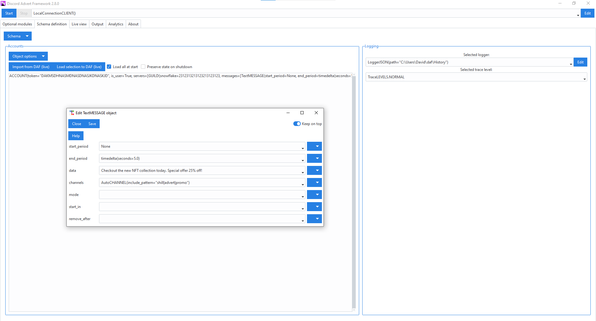
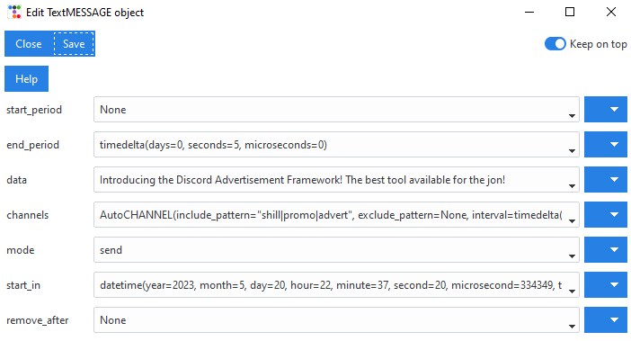

=========================================================
Discord Advertisement Framework
=========================================================
The Discord advertisement framework is a Python based automatic application that allows **easy periodic advertisement** / **shilling** on Discord.

    

----------------
Guide / Usage
----------------
Instructions can be found `here <https://daf.davidhozic.com/en/stable/guide/GUI/quickstart.html>`_.

---------------
Help
---------------
Need help? Contact me in my `Discord server <https://discord.gg/DEnvahb2Sw>`_.

----------------------
Key features
----------------------
- Automatic periodic and scheduled messages to multiple servers and channels,
- Error checking and recovery,
- Message logging, invite link tracking & statistics
- Multi-account support
- Graphical Interface (GUI) / Console (script)
- Easy to setup
- Much more
   
----------------------
Installation
----------------------
DAF can be installed though command prompt/terminal using the bottom commands.

Pre-requirement: `Python (minimum v3.9 and currently max 3.11; 3.12 support is pending) <https://www.python.org/downloads/>`_.

**Main package**

::

    pip install discord-advert-framework

**Voice Messaging / AUDIO**

::

    pip install discord-advert-framework[voice]

**SQL logging**
            
::

    pip install discord-advert-framework[sql]

**Chrome browser integration**

::

    pip install discord-advert-framework[web]
            
**All of the above (full package)**

::

    pip install discord-advert-framework[all]
