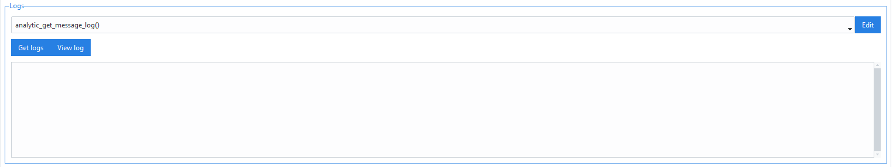
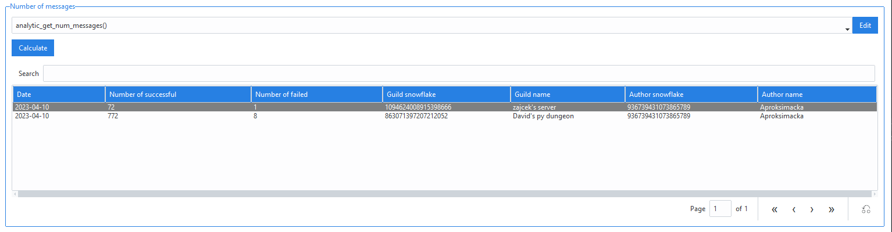
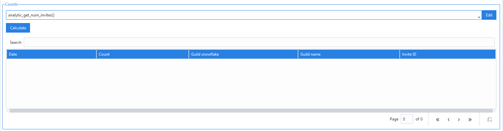
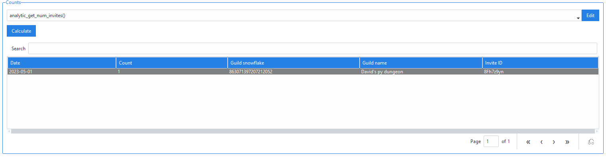

======================
Analytics (GUI)
======================

.. versionchanged:: 2.7
    
    Added invite link tracking.

.. caution::

    Analytics are currently **only** available if SQL is used for logging (:class:`~daf.logging.sql.LoggerSQL`).

.. image:: ./images/gui-analytics-tab.png
    :align: center

The *Analytics* tab allows users to get insight into sent messages and reached users.
It is on the top-level split into 2 categories, which are :ref:`Message logging` and :ref:`Invite link tracking`.
For both, a sub-tab exists under the *Analytics* tab.

Message logging
======================
The message part of analytics is split into 2 sub-sections.
These are :ref:`Logs frame (message)` and :ref:`Counts frame (message)` .

Logs frame (message)
-----------------------
The logs frame allows retrieval of message logs and their display though the object edit window.

The frame contains a dropdown w/ an edit button for defining parameters and 2 buttons.

The edit button will open up an object edit window where you can define your query parameters. After you click save,
the parameters will get saved into the dropdown menu. When using the *Get logs* button, 
these parameters will be considered. Use *Help* inside the definition window to get insight on the parameters.

Buttons:

1. Get logs - retrieves the logs from the database and inserts them into the list at the bottom,

   .. image:: ./images/gui-analytics-message-frame-get-logs.png
       :align: center

2. View log - opens an object edit window which can be used to inspect the log's content (read-only)

   .. image:: ./images/gui-analytics-message-frame-view-log.png
       :align: center

Counts frame (message)
--------------------------

Counts frame can be used to count the amount of successful / failed message attempts into a 
specific guild from specific author on the selected day / month / year.

.. image:: ./images/gui-analytics-num-message-frame.png
    :align: center
    

The frame contains one dropdown w/ edit button which can be used to configure the query and one *Calculate*
button.

Clicking on *Edit* will open up a object definition window where you can define the parameters.
Use *Help* inside the definition window to get insight on the parameters.

Clicking on *Calculate* does the SQL analysis and inserts the result into the table below.

    
  

Invite link tracking
======================
The invite tracking is split into 2 sub-sections.
These are :ref:`Logs frame (invites)` and :ref:`Counts frame (invites)` .

.. warning::

    To track invite links, the Members intent (event setting) is needed.
    To use invite link tracking, users need to enable the privileged intent 'SERVER MEMBERS INTENT' inside
    the Discord developer portal and also set the ``members`` intent to True
    inside the ``intents`` parameter of :class:`~daf.client.ACCOUNT`.

    Invites intent is also needed. Enable it by setting ``invites`` to True inside
    the ``intents`` parameter of :class:`~daf.client.ACCOUNT`.

    Invite link tracking is **bot account** only and does not work on user accounts.

Logs frame (invites)
-----------------------
The logs frame allows retrieval of member joins with specific invite link and their display though the object edit window.

    

The frame contains a dropdown w/ an edit button for defining parameters and 2 buttons.

The edit button will open up an object edit window where you can define your query parameters. After you click save,
the parameters will get saved into the dropdown menu. When using the *Get logs* button, 
these parameters will be considered. Use *Help* inside the definition window to get insight on the parameters.

Buttons:

1. Get logs - retrieves the logs from the database and inserts them into the list at the bottom,

   .. image:: ./images/gui-analytics-invite-frame-get-logs.png
       :align: center
       

2. View log - opens an object edit window which can be used to inspect the log's content (read-only)

   .. image:: ./images/gui-analytics-invite-frame-view-log.png
       :align: center

Counts frame (invites)
--------------------------

Counts frame can be used to count the amount of successful / failed message attempts into a 
specific guild from specific author on the selected day / month / year.

    

The frame contains one dropdown w/ edit button which can be used to configure the query and one *Calculate*
button.

Clicking on *Edit* will open up a object definition window where you can define the parameters.
Use *Help* inside the definition window to get insight on the parameters.

Clicking on *Calculate* does the SQL analysis and inserts the result into the table below.

    