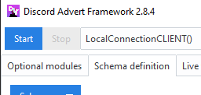

=======================
Framework control (GUI)
=======================

Run control
-------------
The framework can be from the GUI controlled with the 2 buttons located on the top left corner of the GUI.

These buttons are called **START** and **STOP** respectively.

**Start** button will, like the name suggest, start the framework (or connect to a remote server, see :ref:`Remote control (GUI)`).
If the **Load all at start** checkbox inside *Schema definition* tab, Accounts frame, is checked, it will also load all of the
defined account templates into DAF. Additionally the selected logger inside the Logging frame is set to be used to log messages
and invites links and it cannot be changed unless the framework is restarted (the same goes for remote).

Inside the *Output* tab, the core's output can be viewed reporting any runtime errors.

.. image:: images/gui-started-output-defined-accounts.png
    :align: center
