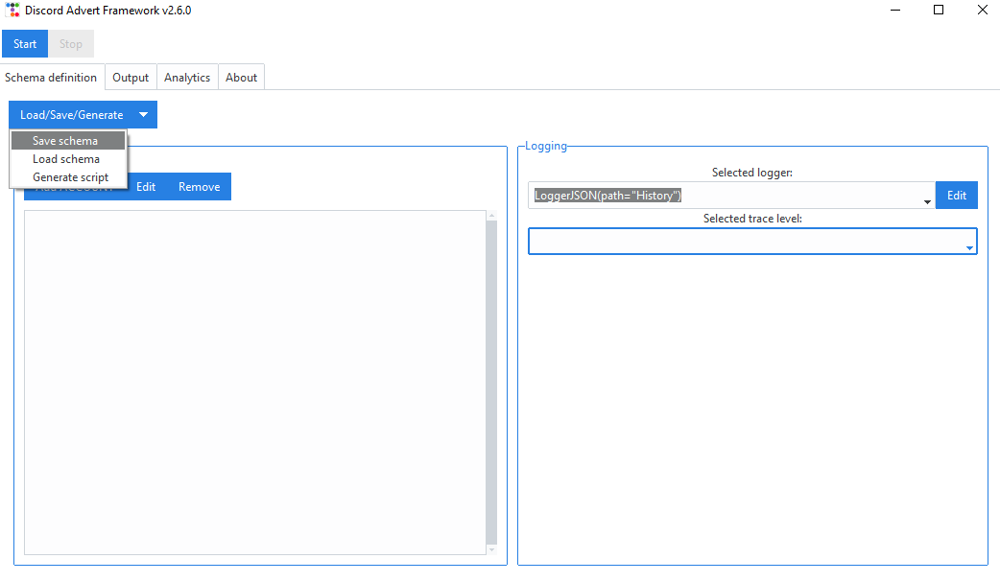
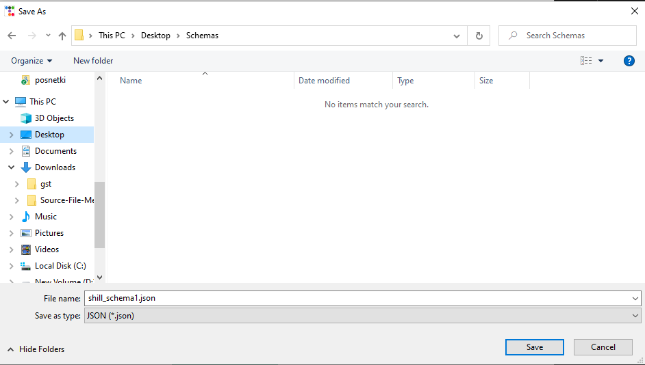
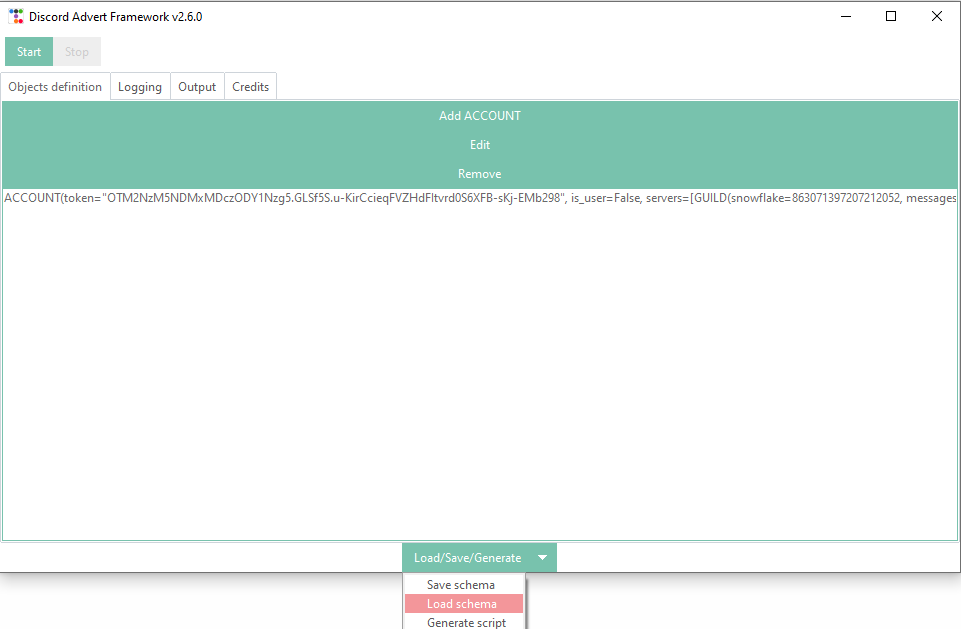
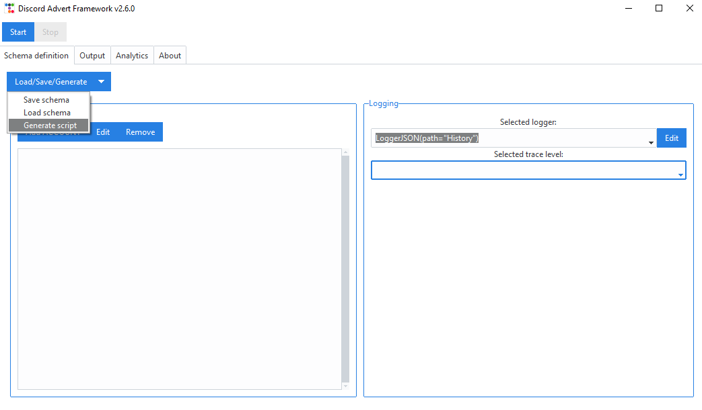

==========================================
Schema backup & Script generation (GUI)
==========================================

DAF's graphical interface allows us to define a schema and run it directly from the GUI.

In case our plan is to advertise to a lot of servers it wouldn't be practical if we had to re-define the schema
every time we re-open the GUI.
This is why DAF-GUI supports **schema backup and restore** and can additionally generate a core DAF Python script
for shilling from the console (appropriate for servers) without needing the graphical interface.

The backups are saved into ``JSON`` files and contain definition of account objects (and it's members such as guilds, messages),
logger list and selected logger & the selected trace configuration.

Schema backup and restore
==========================

Schema backup
---------------
.. seealso::
    :download:`Download example schema backup (schema.json) <./images/schema.json>`

To save a schema after it has been defined, we can click on the *Schema* button, located in the top left
corner of the *Schema definition* tab and then click the **Save schema** option.

We will be asked for a file location of the schema backup, where the GUI will save backup our schema.

Schema restore
---------------
In case we want to restore a backed-up schema, we can click on the *Schema* button, located in the top left
corner of the *Schema definition* tab and then click the **Load schema** option.

We will be asked for a file location of the schema backup, from which the GUI will load our schema. 

Shilling script generation
================================
Before the graphical interface, DAF could only be run from a Python script in which everything was defined.
The graphical interface makes it easier to shill for those who don't know Python, but it also limits it's use to a
a computer capable of displaying image.

Luckily DAF-GUI allows use to create a (Python) shilling script in the event that we want to run DAF on a server 24/7.

To generate a shilling script , we can click on the *Schema* button, located in the top left
corner of the *Schema definition* tab and then click the **Generate script** option.
This will open up a file dialog asking us where to save the shilling script.
After we save the location our shilling script will be generated and we
can run it by using the command ``python <out script here>``.

Here is an example of the shilling script generated from the above option.

.. literalinclude:: images/shill_script.py
    :language: Python
    :caption: shill_script.py - Example shilling script generated from the GUI.

We can run the above file with the following command:

.. code-block:: bash

    $ python shill_script.py

and it will produce the following output while it is running:

.. code-block::

    [2023-04-02 20:19:33.269412] (NORMAL) | daf.client: Logging in... (None)
    [2023-04-02 20:19:36.016167] (NORMAL) | daf.client: Logged in as Aproksimacka (None)
    [2023-04-02 20:19:36.016167] (NORMAL) | daf.core: Initialization complete. (None)

.. note::

    The above script will run exactly the same as it would run inside the graphical interface. Graphical interface
    doesn't add any functionality it self to the Discord Advertisement Framework it self, it just makes it easier to use,
    which means that everything that happens in the GUI, can also happen in the core library (except schema backup / restore).