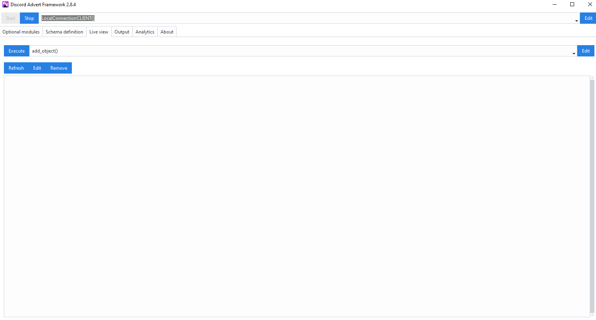
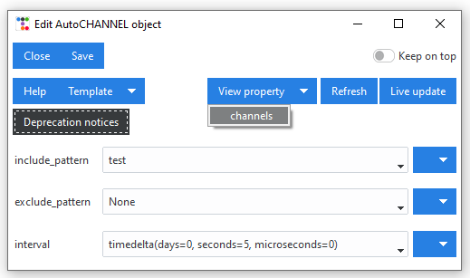
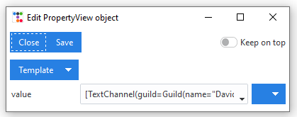
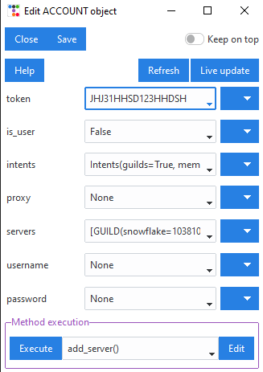
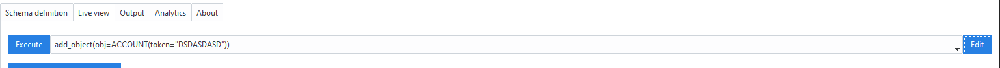

==========================
Live view (GUI)
==========================

While the Schema tab allows user to pre-define a schema, the GUI also has a section called *Live view*.

    Live view tab

Live view allows users to view and update objects that are currently loaded into the framework.
It allows users to modify the original object parameters and then reinitialize the object to use those same
parameters. This can be done by clicking on the **Update** button. Next to the *Update* button, there is a 
**Refresh** button which will reload the GUI with updated values.
If an object does not have a *Update* button, that means the object is not directly supported for live modifications.
In the latter case, users must click the *Save* button, until edit for an object, which supports 
live update, is found. **Clicking on Save does not reflect changes in the actual framework**, but just in the currently
opened window.

When editing / viewing a live object, there is also a **View property** menu button, which allows users to inspect
additional object properties of the object running inside DAF. This can eg. be used to view the channels, that
were found using :class:`~daf.message.AutoCHANNEL` object.

    

Some live objects like :class:`~daf.client.ACCOUNT` also support **method execution**, where you can eg. add or remove
servers without updating the entire object.

At the top of the *Live view* tab, there's also an *Execute* button with a dropdown menu. It allows you to define a new
:class:`~daf.client.ACCOUNT` object by clicking *Edit* and load the object into the framework directly.
However it is recommended that accounts are defined inside the :ref:`Account definition / schema tab (GUI)` and loaded by clicking the
*Load selection to live* button (see :ref:`Loading schema into DAF (GUI)`).

