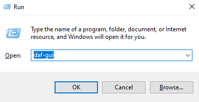

======================
Quickstart (GUI)
======================
This page contains information to quickly getting started with the GUI.

The first thing you need is the library installed, see :ref:`Installation`.

After successful installation, DAF can be run in graphical mode by executing the command ``daf-gui`` command inside the terminal

.. code-block:: bash

    $ daf-gui

or by using ``python -m daf_gui`` command.

.. code-block:: bash

    $ python -m daf_gui

On Windows it can also be started though the Run (Win + R) menu.

This will open up (after a few seconds) a graphical display you can use to control the framework.

.. image:: ./DEP/daf-gui-front.png
    :width: 20cm
    :align: center

GUI structure
================
The GUI consists of:

- Connection section:

  - START / STOP for starting/stopping or connecting/disconnecting from the core.
  - Connection type selection (local or :ref:`remote <Remote control (GUI)>`).

- Tabs:

  - Optional modules tab - Where you can install optional functionallity.
  - Schema definition tab - Where you can statically (as a template) define accounts, guilds, messages & type of logging:

    - Accounts - Section for defining your accounts (and guilds and messages).
    - Logging - Section for defining the logging manager used and the detail of the trace (printouts).
    - "Schema" menu button - Allows save or load of GUI data and generation of a Python script which will advertise
      defined data without a GUI. The script interacts directly with DAF core.

  - Live view - Manipulating running accounts, guilds, messages, etc..
  - Output tab for displaying the DAF core's printouts (eg. message removed, guild removed, started, stopped, ...),
  - Analytics tab for tracking sent messages and invite links:

    This consists of 2 sub tabs, where the first one is for messages and the second one for invite links and each
    tab has 2 distinct sections:

    - Logs - Used to view the actual data stored inside a database.
    - Counts - Table that can show basic statistics related to the logs.

  - About tab (short information on the project).
