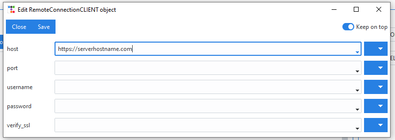

======================
Remote control (GUI)
======================
.. versionadded:: 2.8

.. seealso:: 

    This section describes how to set up the GUI to connect to a server.
    To find information about setting up the actual server see :ref:`Remote control (core)`.

DAF can run either locally or it can connect to a remote server that is running the
DAF core. Users can choose between these two options by changing the connection client as
shown in picture:

.. image:: ./images/gui-connection-select.png
    :width: 1000px

Using ``LocalConnectionCLIENT`` will start DAF locally and anything the users do will be done locally.
Using :class:`~daf_gui.connector.RemoteConnectionCLIENT` will connect to a remote server and anything the users do including adding / removing
accounts, retrieving logs, etc. will be done through a HTTP API which can also be HTTPS (recommended) if desired.

If the *Edit* button is clicked (in the top right corner) and :class:`~daf_gui.connector.RemoteConnectionCLIENT`
is selected, a new window will be opened, which allows customization of connection parameters.

.. autoclass:: daf_gui.connector.RemoteConnectionCLIENT

.. seealso::

    When :ref:`generating the DAF core script <Shilling script generation>`,
    remote access will also be configured if the :class:`~daf_gui.connector.RemoteConnectionCLIENT` is selected.

Clicking on *Edit* when ``LocalConnectionCLIENT`` is selected will show an error.
