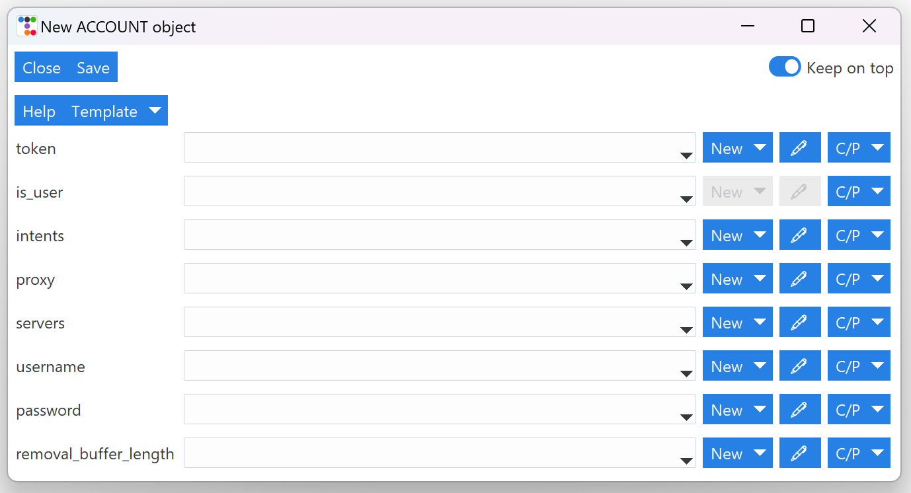
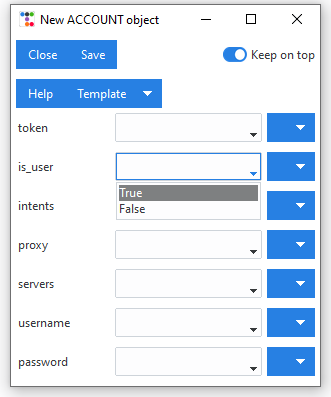
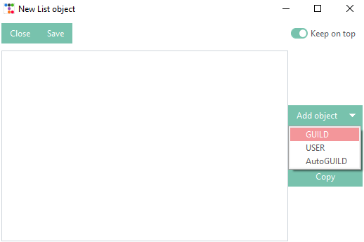
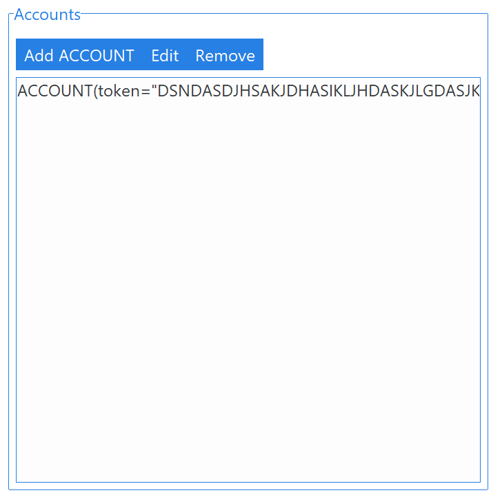
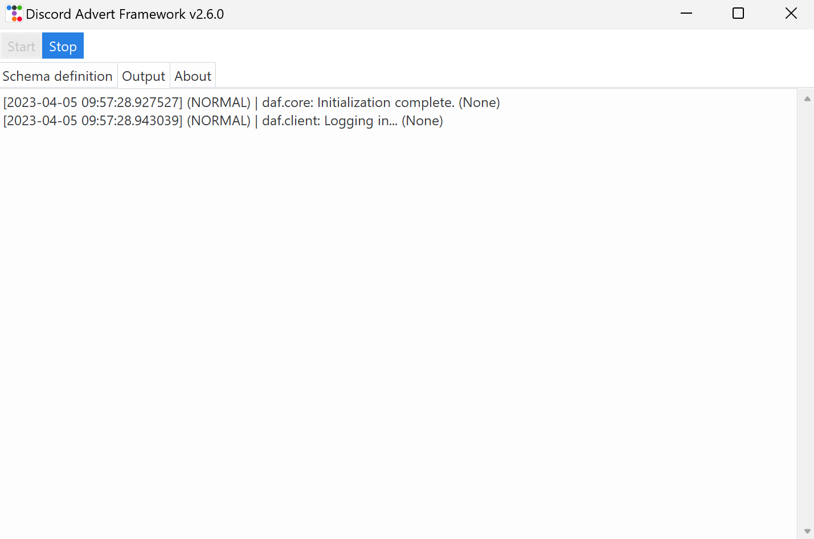
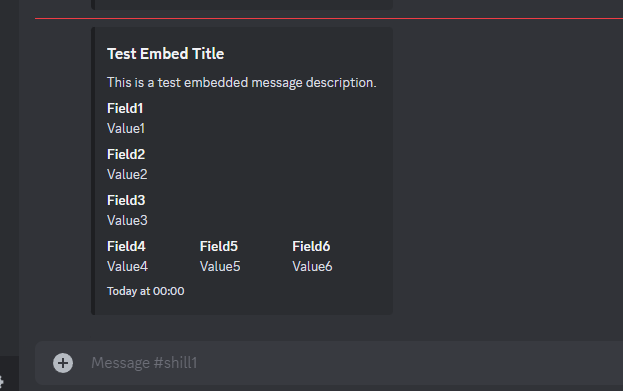
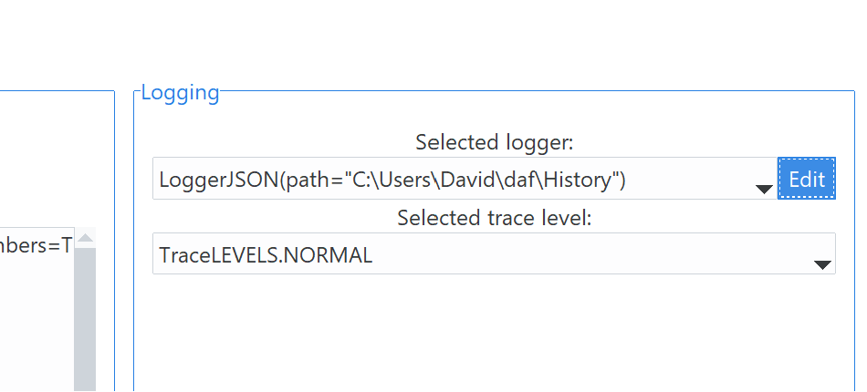
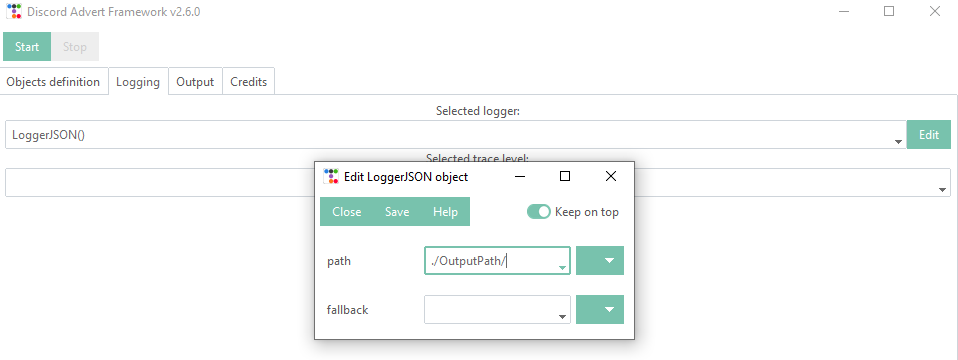
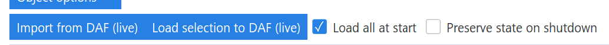

=========================================
Account definition / schema tab (GUI)
=========================================

The *Schema* tab allows users to define a fixed schema **template** that can then be saved (loaded) to (from) file. or
converted into a Python ``.py`` script that runs exactly the same as it would inside the GUI.

-----

Some **important terms** that users need to know if they wish to define objects:

.. glossary::

    Token
        Refers to the Discord account token, which can be obtained for bots though the
        `developer tab <https://discordgsm.com/guide/how-to-get-a-discord-bot-token>`_ or
        though a browser for `user accounts <https://www.androidauthority.com/get-discord-token-3149920/>`_.

    Snowflake (ID)
        The snowflake ID is Discord's unique identifier that each user, channel, guild, etc. has. It is never duplicated
        and it only represents a single Discord object. It is often needed inside DAF.
        To obtain it, first enable `developer mode <https://beebom.com/how-enable-disable-developer-mode-discord/>`_.
        Then you can right click on the wanted resource (eg. channel) and left click on *Copy ID*.

        .. image:: ./DEP/copy-snowflake-id.png
            :height: 300

-----

In the schema tab we can define:

1. Accounts
2. Logging & tracing
3. Connection manager, however this is not inside the schema tab but rather on the top of the GUI.

.. image:: ./DEP/daf-gui-front.png
    :width: 20cm
    :align: center

Defining ACCOUNT objects
==========================

We can define :class:`~daf.client.ACCOUNT` objects by clicking on *Object options* -> *New ACCOUNT*.
This opens a new object definition window.

    Object definition window

Basic information about the object definition window
--------------------------------------------------------

In the toolbar (top) we can observe 3 buttons and one toggle. The **Close** button closes the window and asks the user
if they want to save the object to the previous widget, while the **Save** does the same thing except it saves the object without user
confirmation. The toggle **Keep on top** will prevent other windows from covering the definition window.

The **Help** button opens up the documentation and searches for the corresponding object, in our case, the
:class:`~daf.client.ACCOUNT` object. You can use this button to gain knowledge about what each parameter means.

When defining structured data there is an additional **Template** button which allows users to save (or load) the current
parameters to (from) a JSON file. This is simillar to :ref:`Schema backup & Script generation (GUI)` except it only
backups the current object.

.. note:: Some data types will have additional widgets, such as Color Picker or Datetime select.

Depending on the datatype each parameter accepts, we can either:

1. Select a value from a predefined list by clicking the little arrow in the dropdown menu:

2. Create new value by clicking on the menu button *New* and then select the type you want to define.
   which will open another definition frame.

.. grid:: 2

    .. grid-item::

        .. image:: images/gui-new-item-define.png
            :height: 300

    .. grid-item::

        .. image:: images/gui-new-item-define-string-window.png
            :height: 300

3. Edit current value by clicking on pencil button.

.. grid:: 2

    .. grid-item::

        .. image:: images/gui-new-item-edit.png
            :height: 300

    .. grid-item::

        .. image:: images/gui-new-item-edit-string-window.png
            :height: 300

After we are satisfied with our definition, we can click *Save* to save the changes into the parent (previous) object.

Account definition
-----------------------------
To define an account we can choose from various parameters, the important ones for this guide are:

1. ``token`` - The Discord account token, you can obtain this the following way:

   - BOT accounts - https://discord.com/developers/applications (select your app -> Bot -> Reset / Copy token)
   - USER accounts (self-bots) - https://youtu.be/YEgFvgg7ZPI

2. ``is_user`` - Tells the framework the above token type, this must be set to ``True`` if you want advertise using an user account (self-bot).
3. ``servers`` - A list of :class:`GUILDS <daf.guild.GUILD>` and :class:`USERS <daf.guild.USER>` messages will be sent to.

.. note::

    To logging with **username** and **password** we can use the corresponding fields in the definition window.

    Logging in with username and password happens though the browser and requires additional dependencies which
    can be installed with:

    .. code-block:: bash

        $ pip install discord-advert-framework[web]

    This is only available on desktop computers and cannot be eg. run on a linux server. It is recommended to obtain the
    user token instead unless additional features from the web modules are desired (see :ref:`Web browser (core)`)

After defining the ``token`` and other normal parameters, we can define the servers. Defining servers will open up a new
definition frame which allows you to define multiple GUILD objects.

    New server definition window.

:class:`~daf.guild.GUILD` accepts parameters: ``snowflake``, ``messages``, ``logging`` and ``remove_after``.

``snowflake`` represents Discord's ID of the guild, ``messages`` a list of :class:`~daf.message.TextMESSAGE` &
:class:`~daf.message.VoiceMESSAGE`
objects, ``logging`` is a bool parameter which enables / disables logging of sent messages for this guild and ``remove_after``
parameter specifies the time or time delay for this guild to be auto removed from the list.

:class:`~daf.guild.USER` accepts the same parameters, except ``messages`` is a list of :class:`~daf.message.DirectMESSAGE`
objects.

For more information about the parameters and definition for other objects click the *Help* button or search for
the object in :ref:`API reference` or read the :ref:`core guide <Guide (core)>`.

Successful account definition
~~~~~~~~~~~~~~~~~~~~~~~~~~~~~~

After successful definition, we can observe a new account added to our accounts list.

If we click the *Start* (on top of the main window), we can observe our account being logged-in and messages being sent
to the defined guilds and channels.

Logging definition (GUI)
-------------------------
We can also define what type of logging DAF will use to log sent messages and the detail of prints inside the
*Logging* section of the *Schema definition* tab

To configure a logger we can select the wanted logger and click on the *Edit* button,
located on the right side of the 1st dropdown menu.

After clicking on *Save*, our logging manager is now defined and will be responsible for logging the data.

In the 2nd dropdown we can now select the debug / trace level. Value *DEPRECATED* will only show deprecation notices and
is the least detailed trace configuration, while *DEBUG* will print all the information, including the debugging ones -
it is considered the most detailed trace configuration.

.. image:: images/gui-logger-definition-tracing.png
    :align: center
    :width: 20cm

*NORMAL* trace is recommended for most users.

For more information about logging refer to the core documentation - :ref:`Logging (core)`.

Loading schema into DAF (GUI)
===============================
The *Load all at start* checkbox causes (when checked) the GUI to load all the accounts into DAF right after the *Start*
button in the top left corner is pressed. If the checkbox is not checked, accounts can be loaded by
selecting them in the list and then clicking on the *Load selection to live* button.

The *Preserve state on shutdown* checkbox sets the ``save_to_file`` parameter inside :func:`~daf.core.run` to True if checked
or False if not checked. Basically this means that if the checkbox is checked, DAF will save the accounts list (and guilds, messages, ...)
to a binary file on DAF shutdown and every 2 minutes to prevent data loss on force shutdown.
When starting DAF again, the same list will be loaded from file into DAF.

State preservation is not really meant as a shilling feature where you can define the schema statically inside the GUI and save it to a JSON file,
but it's meant to be used in case DAF will have accounts, guilds, messages dynamically added while it's running (added in *Live view*).

If *Import from live* is pressed, the GUI will copy the accounts loaded inside daf into our list.

Logger is automatically loaded at start and cannot be changed for a different logger without stopping the framework first.

