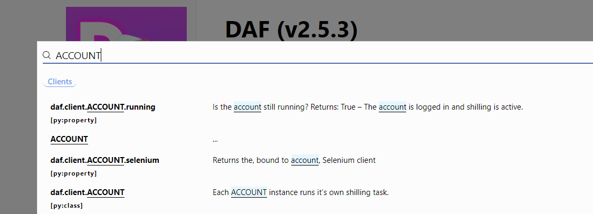
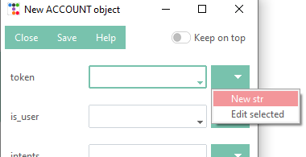
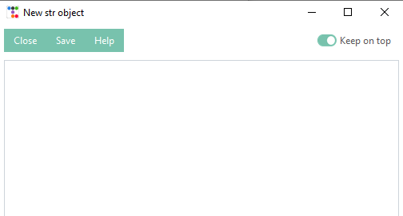
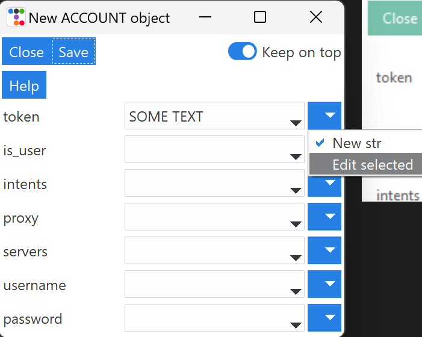
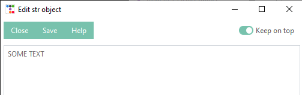

=========================
Schema definition (GUI)
=========================

We can define the schema (accounts, guilds, messages) inside the *Schema definition* tab.
The tab allows us to define:

1. Accounts
2. Logging & tracing

.. image:: ./DEP/images/daf-gui-front.png
    :scale: 70%
    :align: center

Defining ACCOUNT objects
==========================

Basic information
------------------
We can define :class:`~daf.client.ACCOUNT` objects by clicking on ``Add ACCOUNT`` button which opens a new window.

.. image:: images/gui-new-account-window.png
    :align: center
    :scale: 70%

The window is automatically generated based on the :class:`~daf.client.ACCOUNT`'s parameter annotations and contains exactly the same
parameters like the core object :class:`~daf.client.ACCOUNT`.

In the toolbar (top) we can observe 3 buttons and one toggle. The **Close** button closes the window and asks the user
if they want to save the object, while the **Save** does the same thing except it saves the object without user
confirmation. The toggle **Keep on top** will prevent other windows from covering our definition window.

The **Help** button opens up the documentation and searches for the corresponding object, in our case, the
:class:`~daf.client.ACCOUNT` object. You can use this button to gain knowledge about what each **parameter does**
and which **types it accepts**.

.. note:: Some data types will have additional widgets, such as Color Picker or Datetime select.

In the main frame (below the toolbar) we can see different labels and dropdown menus with one button on the right side.
These represent the **parameters** of the corresponding objects. These are exactly the same as in the DAF's core library
- :ref:`Guide (core)`.

Defining object parameters
---------------------------
Depending on the datatype each parameter accepts, we can either:

1. Select a value from a predefined list by clicking the little arrow in the dropdown menu:

.. image:: images/gui-predefined-value-select.png
    :align: center
    :scale: 40%

2. Create new value by clicking on the button on the right side of the dropdown and clicking *New <datatype>*,
   which will open another definition window.

3. Edit a value (selected in the dropdown) by clicking on the button on the right side of the dropdown and clicking
   *Edit selected*, which will open a new definition window for the specific datatype and load in the previously defined
   values.

After we are satisfied with our definition, we can click *Save* to save the changes into the parent (previous) object.

Account definition
-----------------------------
To define an account we can choose from various parameters, the important ones for this guide are:

1. ``token`` - The Discord account token, you can obtain this the following way:

   - BOT accounts - https://discord.com/developers/applications (select your app -> Bot -> Reset / Copy token)
   - USER accounts (self-bots) - https://youtu.be/YEgFvgg7ZPI

2. ``is_user`` - Tells the framework the above token type, this must be set to ``True`` if you want advertise using an user account (self-bot).
3. ``servers`` - A list of GUILDS and USERS messages will be sent to.

For additional information about these see :ref:`Guide (core)` or click the *Help* button.

.. note::

    To logging with **username** and **password** we can use the corresponding fields in the definition window.

    Logging in with username and password happens though the browser and requires additional dependencies which
    can be installed with:

    .. code-block:: bash

        $ pip install discord-advert-framework[web]

    This is only available on desktop computers and cannot be eg. run on a linux server. It is recommended to obtain the
    user token instead unless additional features from the web modules are desired (see :ref:`Web browser (core)`)

After defining the ``token`` and other normal parameters, we can define the servers. Defining servers will open up a new
definition window which allows you to define multiple GUILD objects.

.. figure:: images/gui-new-server-list.png
    :scale: 40%

    New server definition window.

For help with parameters click the *Help* button or see :ref:`Sending messages (core)`.

Defining everything else is pretty much the same, for help click the *Help* button or refer to the core documentation
:ref:`Guide (core)`.

Successful account definition
~~~~~~~~~~~~~~~~~~~~~~~~~~~~~~

After successful definition, we can observe a new account added to our accounts list.

.. image:: images/gui-defined-accounts-list.png
    :align: center
    :scale: 70%

If we click the *Start* (on top of the main window), we can observe our account being logged-in and messages being sent
to the defined guilds and channels.

.. image:: images/gui-started-output-defined-accounts.png
    :align: center
    :scale: 70%

.. image:: images/gui-messages-sent-post-acc-definition.png
    :align: center

Logging definition (GUI)
-------------------------
We can also define what type of logging DAF will use to log sent messages and the detail of prints inside the
*Logging* section of the *Schema definition* tab

To configure a logger we can select the wanted logger and click on the *Edit* button,
located on the right side of the 1st dropdown menu.

.. image:: images/gui-logger-definition-edit-json.png
    :align: center
    :scale: 70%

After clicking on *Save*, our logging manager is now defined and will be responsible for logging the data.

In the 2nd dropdown we can now select the debug / trace level. Value *DEPRECATED* will only show deprecation notices and
is the least detailed trace configuration, while *DEBUG* will print all the information, including the debugging ones -
it is considered the most detailed trace configuration.

.. image:: images/gui-logger-definition-tracing.png
    :align: center
    :scale: 70%

*NORMAL* trace is recommended for most users.

For more information about logging refer to the core documentation - :ref:`Logging (core)`.
