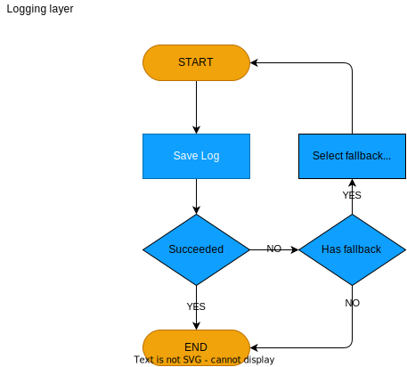
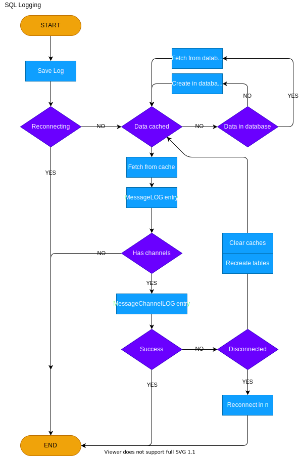
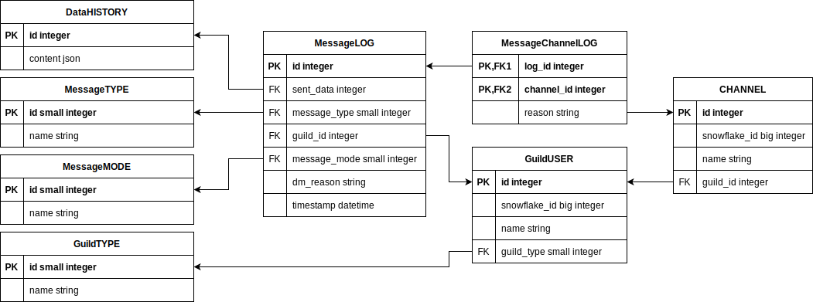

====================
Logging
====================

.. |PK| replace:: **[Primary Key]**
.. |FK| replace:: **[Foreign Key]**

The framework allows to log sent messages for each :ref:`GUILD`/:ref:`USER` (if you set the "logging" to True inside the :ref:`GUILD` or :ref:`USER` object).

Logging is handled thru so called **logging managers**. Currently, 3 different managers exists:

- LoggerJSON: Used for saving file logs in the JSON format. (:ref:`JSON Logging (file)`)
- LoggerCSV:  Used for saving file logs in the CSV format, where certain fields are still JSON. (:ref:`CSV Logging (file)`)
- LoggerSQL:  Used for saving relational database logs into a remote database. (:ref:`Relational Database Log (SQL)`)
- Custom logger: User can create a custom logger if they desire. (:ref:`Custom Logger`)

If a logging managers fails saving a log, then it's fallback manager will be used temporarily to store the log.
It will only use the fallback once and then, at the next message, the original manager will be used.

    
    Logging process with fallback

JSON Logging (file)
=========================
The logs are written in the JSON format and saved into a JSON file, that has the name of the guild or an user you were sending messages into.
The JSON files are fragmented by day and stored into folder ``Year/Month/Day``, this means that each day a new JSON file will be generated for that specific day for easier managing,
for example, if today is ``13.07.2022``, the log will be saved into the file that is located in 

.. code-block::

    History
    └───2022
    │   └───07
    │       └───13
    |           └─── #David's dungeon.json

JSON structure
------------------
The log structure is the same for both :class:`~daf.guild.USER` and :class:`~daf.guild.GUILD`.
All logs will contain keys:

- "name": The name of the guild/user
- "id": Snowflake ID of the guild/user
- "type": object type (GUILD/USER) that generated the log.
- "message_history": Array of logs for each sent message to the guild/user, the structure is message type dependant and is generated inside  methods:

  + :py:meth:`daf.message.TextMESSAGE.generate_log_context`
  + :py:meth:`daf.message.VoiceMESSAGE.generate_log_context`
  + :py:meth:`daf.message.DirectMESSAGE.generate_log_context`

.. seealso:: 
    :download:`Example structure <../DEP/Examples/Logging/JSON files/History/2022/05/23/#David's dungeon.json>`

.. only:: html

    JSON code example
    -----------------
    .. literalinclude:: ../DEP/Examples/Logging/JSON files/main_rickroll.py
        :language: python
        :caption: Code to produce JSON logs
        

CSV Logging (file)
=========================
The logs are written in the CSV format and saved into a CSV file, that has the name of the guild or an user you were sending messages into.
The CSV files are fragmented by day and stored into folder ``Year/Month/Day``, this means that each day a new CSV file will be generated for that specific day for easier managing,
for example, if today is ``13.07.2023``, the log will be saved into the file that is located in 

.. code-block::

    History
    └───2023
    │   └───07
    │       └───13
    |           └─── #David's dungeon.csv

CSV structure
------------------
The structure contains the following attributes:

- Timestamp (string)
- Guild Type (string),
- Guild Name (string),
- Guild Snowflake (integer),
- Message Type (string),
- Sent Data (json),
- Message Mode (non-empty for :class:`~daf.message.TextMESSAGE` and :class:`~daf.message.DirectMESSAGE`) (string),
- Message Channels (non-empty for :class:`~daf.message.TextMESSAGE` and :class:`~daf.message.VoiceMESSAGE`) (json),
- Success Info (non-empty for :class:`~daf.message.DirectMESSAGE`) (json),

.. note::
    Attributes marked with ``(json)`` are the same as in :ref:`JSON Logging (file)`

.. seealso::
    :download:`Structure example <../DEP/Examples/Logging/CSV files/History/2022/09/22/David's py dungeon.csv>`

.. only:: html

    CSV code example
    -----------------
    .. literalinclude:: ../DEP/Examples/Logging/CSV files/main_rickroll.py
        :language: python
        :caption: Code to produce JSON logs
        

Relational Database Log (SQL)
================================
.. versionadded:: v1.9

.. versionchanged:: v2.1
    
    .. card::
        
        Turned into an optional feature.
        ^^^^^^^^^^^^^^^^^^^^^^^^^^^^^^^^^
        .. code-block:: bash
            
            pip install discord-advert-framework[sql]

.. versionchanged:: v2.2

    .. card::

        :Additional dialect support: Microsoft SQL Server, PostgreSQL, MariaDB/MySQL, SQLite
        :Better Caching: Improved caching to significantly increase logging speed
        :asynchronous: All of the SQL connectors except MS SQL Server are asynchronous.

This type of logging enables saving logs to a remote server inside the database.
In addition to being smaller in size, database logging takes up less space and it allows easier data analysis.

    SQL Logging diagram

Dialects
----------------------
The dialect is selected via the ``dialect`` parameter in :class:`~daf.logging.sql.LoggerSQL`.
The following dialects are supported:

- Microsoft SQL Server
- PostgreSQL
- SQLite,
- MySQL

Usage
--------------------------------
For daf to use SQL logging, you need to pass the :func:`~daf.core.run` function with the ``logger`` parameter and pass it the :class:`~daf.logging.sql.LoggerSQL` object.

.. only:: html

    .. literalinclude:: ../DEP/Examples/Logging/SQL Logging/rolls.py
        :language: python
        

Features
--------------------------------
- Automatic creation of the schema
- Caching for faster logging
- Low redundancy for reduced file size
- Automatic error recovery

.. note:: 

    The database must already exist! However it can be completely empty, no need to manually create the schema.

ER diagram
--------------------------------

Tables
--------------------------------

MessageLOG
~~~~~~~~~~~~~~~~~~~~
:Description:
    This table contains the actual logs of sent messages, if the message type is :ref:`DirectMESSAGE`, then all the information is stored in this table.
    If the types are **Voice/Text** MESSAGE, then channel part of the log is saved in the :ref:`MessageChannelLOG` table.

:Attributes:
  - |PK| id: Integer  - This is an internal ID of the log inside the database.
  - sent_data: Integer - Foreign key pointing to a row inside the :ref:`DataHISTORY` table.
  - message_type: SmallInteger - Foreign key ID pointing to a entry inside the :ref:`MessageTYPE` table.
  - guild_id: Integer -  Foreign key pointing to :ref:`GuildUSER` table.
  - message_mode: SmallInteger - Foreign key pointing to :ref:`MessageMODE` table. This is non-null only for :ref:`DirectMESSAGE`.
  - dm_reason: String -  If MessageTYPE is not DirectMESSAGE or the send attempt was successful, this is NULL, otherwise it contains the string representation of the error that caused the message send attempt to be unsuccessful.
  - timestamp: DateTime - The timestamp of the message send attempt.
  

DataHISTORY
~~~~~~~~~~~~~~~~~~~~
:Description:
    This table contains all the **different** data that was ever advertised. Every element is **unique** and is not replicated.
    This table exist to reduce redundancy and file size of the logs whenever same data is advertised multiple times.
    When a log is created, it is first checked if the data sent was already sent before, if it was the id to the existing :ref:`DataHISTORY` row is used,
    else a new row is created.

:Attributes:
  - |PK| id: Integer - Internal ID of data inside the database.
  - content: JSON -  Actual data that was sent.

MessageTYPE
~~~~~~~~~~~~~~~~~~~~
:Description:
    This is a lookup table containing the the different message types that exist within the framework (:ref:`Messages`).

:Attributes:
  - |PK| id: SmallInteger - Internal ID of the message type inside the database.
  - name: String - The name of the actual message type.

GuildUSER
~~~~~~~~~~~~~~~~~~~~
:Description:
    The table contains all the guilds/users the framework ever generated a log for.

:Attributes:
  - |PK| id: Integer - Internal ID of the Guild/User inside the database.
  - snowflake_id: BigInteger - The discord (snowflake) ID of the User/Guild
  - name: String - Name of the Guild/User
  - guild_type: SmallInteger - Foreign key pointing to :ref:`GuildTYPE` table.

MessageMODE
~~~~~~~~~~~~~~~~~~~~
:Description:
    This is a lookup table containing the the different message modes available by :ref:`TextMESSAGE` / :ref:`DirectMESSAGE`, it is set to null for :ref:`VoiceMESSAGE`.

:Attributes:
  - |PK| id: SmallInteger - Internal identifier of the message mode inside the database.
  - name: String - The name of the actual message mode.

GuildTYPE
~~~~~~~~~~~~~~~~~~~~
:Description:
    This is a lookup table containing types of the guilds inside the framework (:ref:`Guilds`).

:Attributes:
  - |PK| id: SmallInteger -  Internal identifier of the guild type inside the database.
  - name: String - The name of the guild type.

CHANNEL
~~~~~~~~~~~~~~~~~~~~
:Description:
    The table contains all the channels that the framework ever advertised into.

:Attributes:
  - |PK| id: Integer - Internal identifier of the channel inside the database
  - snowflake_id: BigInteger - The discord (snowflake) identifier representing specific channel
  - name: String - The name of the channel
  - guild_id: Integer - Foreign key pointing to a row inside the :ref:`GuildUSER` table. It points to a guild that the channel is part of.

MessageChannelLOG
~~~~~~~~~~~~~~~~~~~~
:Description:
    Since messages can send into multiple channels, each MessageLOG has multiple channels which
    cannot be stored inside the :ref:`MessageLOG`.
    This is why this table exists. It contains channels of each :ref:`MessageLOG`.

:Attributes:
  - |PK| |FK| log_id: Integer - Foreign key pointing to a row inside :ref:`MessageLOG` (to which log this channel log belongs to).
  - |PK| |FK| channel_id: Integer  - Foreign key pointing to a row inside the :ref:`CHANNEL` table.
  - reason: String - Reason why the send failed or ``NULL`` if send succeeded.

Custom Logger
====================
If you want to use a different logging scheme than the ones built in, you can do so by creating a custom logging manager that 
inherits the :class:`daf.logging.LoggerBASE`.

The derived logger class can then implement the following methods:

1. __init__(self, param1, param2, ...) [Required]:
    The method used for passing parameters and for basic non-async initialization.
    This method must contain a fallback parameter and also needs to have an attribute of the same name.

    .. code-block:: python
        :caption: Custom __init__ method

         class LoggerCUSTOM(daf.logging.LoggerBASE):
            def __init__(self, ..., logger):
                ... # Set attributes
                super().__init__(logger)

            ... # Other methods

2. async initialize(self) [Optional]:
    The base's ``initialize`` method calls ``initialize`` method of it's fallback,
    if it fails then the fallback is set to None.
    
    If you wish to do additional initialization that requires async/await operations, you can implement
    your own ``initialize`` method but make sure you call the base's method in the end.
    
    .. code-block:: python
        :caption: Custom initialize method

        class LoggerCUSTOM(daf.logging.LoggerBASE):
            ... # Other methods

            async def initialize(self):
                ... # Custom implementation code
                await super().initialize()
    

3. async _save_log(self, guild_context: dict, message_context: dict) [Required]:
    Method that stores the message log. 
    If there is any error in saving the log an exception should be raised, which will then
    make the logging module automatically use the fallback manager, **do not call the fallback manager from this method!**

    :Parameters:
        **guild_context** (dict) - Contains keys:
        
        - "name": The name of the guild/user (str)
        - "id": Snowflake ID of the guild/user (int)
        - "type": object type (GUILD/USER) that generated the log. (str)

        **message_context** (dict) - Dictionary returned by:
        
        - :py:meth:`daf.message.TextMESSAGE.generate_log_context`
        - :py:meth:`daf.message.VoiceMESSAGE.generate_log_context`
        - :py:meth:`daf.message.DirectMESSAGE.generate_log_context`

4. async update(self, \*\*kwargs) [Optional]:
    Custom implementation of the ``update`` method.

    This method is used for updating the parameters that are available thru ``__init__`` method and
    **is not required if the attributes inside the object have the same name as the parameters inside the** ``__init__`` **function**
    and there are no pre-required steps that need to be taken before updating (see :ref:`JSON Logging (file)`'s code for example).

    However if the name of attributes differ from parameter name or the attribute doesn't exist at all or other steps are 
    required than just re-initialization (see :class:`daf.logging.sql.LoggerSQL`'s update method), then this method is required to be implemented.
    It should be implemented in a way that it calls the base update method.
    Example:
    
    .. code-block:: python
        
    
        class LoggerCUSTOM(daf.logging.LoggerBASE):
            def __init__(self, name, fallback):
                self._name = name
                super().__init__(fallback)
            
            ... # Other methods

            async def update(self, **kwargs)
                # Only modify if the parameter is not passed to update method
                if "name" not kwargs: 
                    # The name parameter is stored under "_name" attribute instead of "name"
                    kwargs["name"] = self._name

                ... # Other pre-required code (eg. remote SQL server needs to be disconnected)

                super().update(**kwargs) # Call base update method