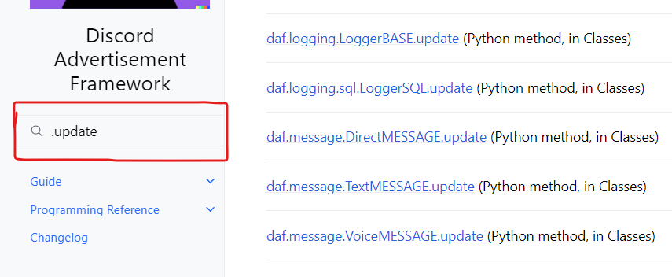

=========================
Dynamic modification
=========================
This document describes how the framework can be modified dynamically.

----------------------------
Modifying the shilling list
----------------------------
See :ref:`Dynamic mod.` for more information about the **functions** mentioned below.

While the shilling list can be defined statically (pre-defined) by creating a list and using the ``servers``
parameter in the :class:`~daf.client.ACCOUNT` instances (see :ref:`Quickstart`),
the framework also allows the objects to be added or removed dynamically from the user's program after the framework has already been started and initialized.

Dynamically adding objects
~~~~~~~~~~~~~~~~~~~~~~~~~~~~
Objects can be dynamically added using the :func:`daf.core.add_object` coroutine function.
The function can be used to add the following object types:

.. card::

    Accounts
    ^^^^^^^^^^^

    :class:`daf.client.ACCOUNT`

.. card::

    Guilds
    ^^^^^^^^^^^^

    :class:`daf.guild.GUILD`

    :class:`daf.guild.USER`

    :class:`daf.guild.AutoGUILD`

.. card::

    Messages
    ^^^^^^^^^^^^
    :class:`daf.message.TextMESSAGE`

    :class:`daf.message.VoiceMESSAGE`

    :class:`daf.message.DirectMESSAGE`

    .. note::   
        Messages can also be added thru the :py:meth:`daf.guild.GUILD.add_message`
        / :py:meth:`daf.guild.USER.add_message` method.

        .. caution::
            The guild must already be added to the framework, otherwise this method will fail.

        .. code-block:: python

            ...
            my_guild = daf.GUILD(guild.id, logging=True)
            await daf.add_object(my_guild, account)
            await my_guild.add_message(daf.TextMESSAGE(...))
            ...

.. only:: html

    .. literalinclude:: ../DEP/Examples/Dynamic Modification/main_add_object.py
        :language: python

Dynamically removing objects
~~~~~~~~~~~~~~~~~~~~~~~~~~~~~
As the framework supports dynamically adding new objects to the shilling list, it also supports dynamically removing those objects.
Objects can be removed with the :func:`daf.core.remove_object`.

.. only:: html

    .. literalinclude:: ../DEP/Examples/Dynamic Modification/main_remove_object.py
        :language: python

----------------------------
Modifying objects
----------------------------
Some objects in the framework can be dynamically updated thru the ``.update()`` method. 
The principle is the same for all objects that support this and what this method does is it
updates the original parameters that can be passed during object creation.

.. warning::

    This completely resets the state of the object you are updating, meaning that if you do call the 
    ``.update()`` method, the object will act like it was recreated.

For example if I wanted to change the shilling period of a :class:`daf.message.TextMESSAGE`, I would call the :py:meth:`daf.message.TextMESSAGE.update` method
in the following way:

.. code-block:: python
    :emphasize-lines: 13

    ... # Other code
    # Fixed sending period of 5 seconds
    my_message = daf.message.TextMESSAGE(
                                            start_period=None,
                                            end_period=timedelta(seconds=5),
                                            ... # Other parameters
                                        )

    await daf.add_object(my_message, some_GUILD_object)
    
    # Randomized sending period between 3 and 5 seconds
    await my_message.update(start_period=timedelta(seconds=3)) 
    ... # Other code

For a full list of objects that support ``.update`` search ".update" in the search bar 
**or click on the image below**.

.. only:: html
    
    .. literalinclude:: ../DEP/Examples/Dynamic Modification/main_update.py
        :language: python
        

