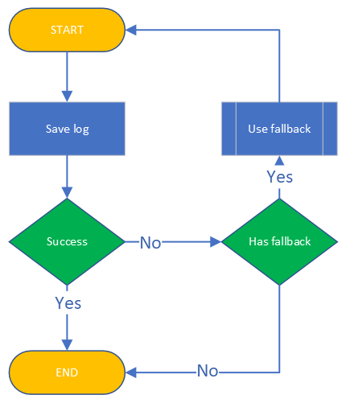

====================
Logging
====================

.. |PK| replace:: **[Primary Key]**
.. |FK| replace:: **[Foreign Key]**

The framework allows to log sent messages for each :ref:`GUILD`/:ref:`USER` (if you set the "logging" to True inside the :ref:`GUILD` or :ref:`USER` object).

Logging is handled thru so called **logging managers**. Currently, 3 different managers exists:

- LoggerJSON: Used for saving file logs in the JSON format. (:ref:`JSON Logging (file)`)
- LoggerCSV:  Used for saving file logs in the CSV format, where certain fields are still JSON. (:ref:`CSV Logging (file)`)
- LoggerSQL:  Used for saving relational database logs into a remote database. (:ref:`Relational Database Log (SQL)`)
- Custom logger: User can create a custom logger if they desire. (:ref:`Custom Logger`)

If a logging managers fails saving a log, then it's fallback manager will be used temporarily to store the log.
It will only use the fallback once and then, at the next message, the original manager will be used unless :func:`set_logger` was used
to manually set the manager to something permanently.

    
    Logging process with fallback

JSON Logging (file)
=========================
The logs are written in the JSON format and saved into a JSON file, that has the name of the guild or an user you were sending messages into.
The JSON files are fragmented by day and stored into folder ``Year/Month/Day``, this means that each day a new JSON file will be generated for that specific day for easier managing,
for example, if today is ``13.07.2022``, the log will be saved into the file that is located in 

.. code-block::

    History
    └───2022
    │   └───07
    │       └───13
    |           └─── #David's dungeon.json

JSON structure
------------------
The log structure is the same for both :class:`~daf.guild.USER` and :class:`~daf.guild.GUILD`.
All logs will contain keys:

- "name": The name of the guild/user
- "id": Snowflake ID of the guild/user
- "type": object type (GUILD/USER) that generated the log.
- "message_history": Array of logs for each sent message to the guild/user, the structure is message type dependant and is generated inside  methods:

  + :py:meth:`daf.message.TextMESSAGE.generate_log_context`
  + :py:meth:`daf.message.VoiceMESSAGE.generate_log_context`
  + :py:meth:`daf.message.DirectMESSAGE.generate_log_context`

.. seealso:: 
    :download:`Example structure <../../Examples/Logging/JSON files/History/2022/05/23/#David's dungeon.json>`

JSON code example
-----------------
.. literalinclude:: ../../Examples/Logging/JSON files/main_rickroll.py
    :language: python
    :caption: Code to produce JSON logs
    :emphasize-lines: 27, 36

CSV Logging (file)
=========================
The logs are written in the CSV format and saved into a CSV file, that has the name of the guild or an user you were sending messages into.
The CSV files are fragmented by day and stored into folder ``Year/Month/Day``, this means that each day a new CSV file will be generated for that specific day for easier managing,
for example, if today is ``13.07.2023``, the log will be saved into the file that is located in 

.. code-block::

    History
    └───2023
    │   └───07
    │       └───13
    |           └─── #David's dungeon.csv

CSV structure
------------------
The structure contains the following attributes:

- Timestamp (string)
- Guild Type (string),
- Guild Name (string),
- Guild Snowflake (integer),
- Message Type (string),
- Sent Data (json),
- Message Mode (non-empty for :class:`~daf.message.TextMESSAGE` and :class:`~daf.message.DirectMESSAGE`) (string),
- Message Channels (non-empty for :class:`~daf.message.TextMESSAGE` and :class:`~daf.message.VoiceMESSAGE`) (json),
- Success Info (non-empty for :class:`~daf.message.DirectMESSAGE`) (json),

.. note::
    Attributes marked with ``(json)`` are the same as in :ref:`JSON Logging (file)`

.. seealso::
    :download:`Structure example <../../Examples/Logging/CSV files/History/2022/09/22/David's py dungeon.csv>`

CSV code example
-----------------
.. literalinclude:: ../../Examples/Logging/CSV files/main_rickroll.py
    :language: python
    :caption: Code to produce JSON logs
    :emphasize-lines: 27, 36

Relational Database Log (SQL)
================================
.. versionadded:: v1.9

.. versionchanged:: v2.1
    Turned into an optional feature.

    .. code-block:: bash
        
        pip install discord-advert-framework[sql]

This type of logging enables saving logs to a remote server inside the database. Currently **only Microsoft SQL server is supported.**.
In addition to being smaller in size, database logging takes up less space and it allows easier data analysis.

Usage
--------------------------------
To use a SQL base for logging, you need to pass the :ref:`run` function with the sql_manager parameter and pass it the LoggerSQL object.

.. literalinclude:: ../../Examples/Logging/SQL Logging/main_rickroll.py
    :language: python
    :emphasize-lines: 27, 36, 37

Features
--------------------------------
+ Automatic creation of tables, procedures, functions, views, triggers
+ Caching for faster logging
+ Low redundancy for reduced file size
+ Automatic error recovery:
  
  - Automatic reconnect on disconnect - Retries 3 times in delays of 5 minutes, then switches to file logging
  - If tables are deleted, they are automatically recreated
  - If cached values get corrupted, they are automatically re-cached
  - If there are un-recoverable errors, the framework switches to file logging

.. note:: 

    The database must already exist! However it can be completely empty, no need to manually create the schema.

ER diagram of the logs
--------------------------------
.. image:: images/er_diagram.png
    :width: 500pt

Tables
--------------------------------

MessageLOG
~~~~~~~~~~~~~~~~~~~~
:Description:
    This table contains the actual logs of sent messages, if the message type is :ref:`DirectMESSAGE`, then all the information is stored in this table.
    If the types are **Voice/Text** MESSAGE, then part of the log (to which channels it sent), is saved in the :ref:`MessageChannelLOG` table.

:Attributes:
  - |PK| id: int  - This is an internal ID of the log inside the database.
  - sent_data: int - Foreign key pointing to a row inside the :ref:`DataHISTORY` table.
  - message_type: int - Foreign key ID pointing to a entry inside the :ref:`MessageTYPE` table.
  - guild_id: int -  Foreign key pointing to :ref:`GuildUSER` table.
  - message_mode: int - Foreign key pointing to :ref:`MessageMODE` table. This is non-null only for :ref:`DirectMESSAGE`.
  - dm_reason: str -  If MessageTYPE is not DirectMESSAGE or the send attempt was successful, this is NULL, otherwise it contains the string representation of the error that caused the message send attempt to be unsuccessful.
  - timestamp: datetime - The timestamp of the message send attempt.
  

DataHISTORY
~~~~~~~~~~~~~~~~~~~~
:Description:
    This table contains all the **different** data that was ever advertised. Every element is **unique** and is not replicated.
    This table exist to reduce redundancy and file size of the logs whenever same data is advertised multiple times.
    When a log is created, it is first checked if the data sent was already sent before, if it was the id to the existing :ref:`DataHISTORY` row is used,
    else a new row is created.

:Attributes:
  - |PK| id: int - Internal ID of data inside the database.
  - content: str -  Actual data that was sent.

MessageTYPE
~~~~~~~~~~~~~~~~~~~~
:Description:
    This is a lookup table containing the the different message types that exist within the framework (:ref:`Messages`).

:Attributes:
  - |PK| id: int - Internal ID of the message type inside the database.
  - name: str - The name of the actual message type.

GuildUSER
~~~~~~~~~~~~~~~~~~~~
:Description:
    The table contains all the guilds/users the framework ever generated a log for.

:Attributes:
  - |PK| id: int - Internal ID of the Guild/User inside the database.
  - snowflake_id: int - The discord (snowflake) ID of the User/Guild
  - name: str - Name of the Guild/User
  - guild_type: int - Foreign key pointing to :ref:`GuildTYPE` table.

MessageMODE
~~~~~~~~~~~~~~~~~~~~
:Description:
    This is a lookup table containing the the different message modes available by :ref:`TextMESSAGE` / :ref:`DirectMESSAGE`, it is set to null for :ref:`VoiceMESSAGE`.

:Attributes:
  - |PK| id: int - Internal identifier of the message mode inside the database.
  - name: str - The name of the actual message mode.

GuildTYPE
~~~~~~~~~~~~~~~~~~~~
:Description:
    This is a lookup table containing types of the guilds inside the framework (:ref:`Guilds`).

:Attributes:
  - |PK| id: int -  Internal identifier of the guild type inside the database.
  - name: str - The name of the guild type.

CHANNEL
~~~~~~~~~~~~~~~~~~~~
:Description:
    The table contains all the channels that the framework ever advertised into.

:Attributes:
  - |PK| id: int - Internal identifier of the channel inside the database
  - snowflake_id: int - The discord (snowflake) identifier representing specific channel
  - name: str - The name of the channel
  - guild_id: int - Foreign key pointing to a row inside the :ref:`GuildUSER` table. It points to a guild that the channel is part of.

MessageChannelLOG
~~~~~~~~~~~~~~~~~~~~
:Description:
    Since messages can send into multiple channels, each MessageLOG has multiple channels which
    cannot be stored inside the :ref:`MessageLOG`.
    This is why this table exists. It contains channels of each :ref:`MessageLOG`.

:Attributes:
  - |PK| |FK| log_id: int ~ Foreign key pointing to a row inside :ref:`MessageLOG` (to which log this channel log belongs to).
  - |PK| |FK| channel_id  ~ Foreign key pointing to a row inside the :ref:`CHANNEL` table.

SQL custom data types
--------------------------------
.. warning::
    These will be removed in the next version.

This sections contains descriptions on all SQL data types that are user-defined.

t_tmp_channel_log
~~~~~~~~~~~~~~~~~~~~
:Description:
    This is only used in the :ref:`sp_save_log` procedure to accept a list of channels it was attempted to send into and the reason for failure.
    This is a custom table type that contains attributes:

:Attributes:
    - id: int ~ Internal DB id pointing to :ref:`CHANNEL` table.
    - reason: nvarchar ~ Reason why sending to the channel failed, if it was successful then this is NULL.

SQL Stored Procedures (SP)
--------------------------------
.. warning::
    These will be removed in the next version.

This section contains the description on all the saved procedures inside the SQL database.

sp_save_log
~~~~~~~~~~~~~~~~
.. code-block:: t-sql

    sp_save_log(@sent_data nvarchar(max),
            @message_type smallint,
            @guild_id int,
            @message_mode smallint,
            @dm_reason nvarchar(max),
            @channels t_tmp_channel_log READONLY

:Description:
    This procedure is used by the SQL python module to store the log instead of using SQLAlchemy for faster saving speed.

:Attributes:
    - sent_data: nvarchar -  The data that was sent (jsonized).
    - message_type: smallint - Internal DB id that points to :ref:`MessageTYPE` table.
    - guild_id: int ~ Internal DB id that points to :ref:`GuildUSER` table.
    - message_mode: smallint - Internal DB id that points to :ref:`MessageMODE` table.
    - dm_reason: nvarchar -  This can only be different from NULL if the type of message is DirectMESSAGE. In the case that the message type is :ref:`DirectMESSAGE`, then this attribute is different from NULL when the send attempt failed, if send attempt succeeded, then this is NULL.
    - channels: :ref:`t_tmp_channel_log` ~ Table Valued Parameter (TVP) - Holds channels it was advertised into, if message type is DirectMESSAGE, this is an empty table.

SQL User Defined Functions (UDF)
----------------------------------
.. warning::
    These will be removed in the next version.

This section contains the description on all user defined functions inside the SQL database.

fn_log_success_rate
~~~~~~~~~~~~~~~~~~~~
.. code-block:: t-sql

    fn_log_success_rate(@log_id int)

:Description:
    This UDF can only be used for logs that have channels, so logs that originated from :ref:`TextMESSAGE` or :ref:`VoiceMESSAGE`. The UDF calculates relative success of sent channels for a specific log entry (successful channels / all channels) which is a number between 0 and 1, 0 meaning no channels succeeded and 1 meaning all channels succeeded.

:Parameters:
  - log_id: int - The DB id of a certain log that is inside the database.

:Return:
    The UDF returns the success rate - a number of type ``decimal`` with 5 decimals of precision.

.. note:: 

    If the log_id is an id of a message log that has no channels, the UDF will return 1.

fn_guilduser_success_rate
~~~~~~~~~~~~~~~~~~~~~~~~~~
.. code-block:: t-sql
    
    fn_log_success_rate(@snowflake_id bigint, @limit int = 1000)

:Description:
    This UDF returns relative success rate for specific GUILD/USER based on the last few logs.
    Success rate is defined as (number of **fully** successful send attempts) / (number of all send attempts)

:Parameters:
  - snowflake_id: bigint ~ Discord's ID (snowflake id) of the USER or GUILD you want to get the success rate for
  - limit: int ~ How many of the latest logs you want to use to calculate the relative success rate

:Return:
    The UDF returns the success rate ~ a number of type ``decimal`` with 5 decimals of precision.

.. note::
    
    If no logs exist for specific GUILD/USER, 1 is returned.

Views
----------------------------------
.. warning::
    These will be removed in the next version.

This section contains the description on all views inside the SQL database.

vMessageLogFullDETAIL
~~~~~~~~~~~~~~~~~~~~~~~~

:Description:
    The :ref:`MessageLOG` table contains mostly internal DB ids which makes it hard to see anything directly from it. This is why the :ref:`vMessageLogFullDETAIL` view exists. It contains all the information inside the MessageLOG table, but expanded with actual values and not just IDs making it easier to view the content of the log.

Triggers
----------------------------------
.. warning::
    These will be removed in the next version.

This section contains the description on all the triggers inside the SQL database.

tr_delete_msg_log
~~~~~~~~~~~~~~~~~~~

:Description:
    Entries in :ref:`MessageChannelLOG` get deleted if an entry inside :ref:`MessageLOG` gets deleted due to the :ref:`MessageChannelLOG` table having a cascading foreign key pointing to the :ref:`MessageLOG` table. However reverse is not the same, the :ref:`MessageLOG` table does not have anything pointing to the :ref:`MessageChannelLOG` table meaning that cascading based on foreign keys is not possible. 
    This trigger's job is to delete an entry inside the MessageLOG when all the entries in :ref:`MessageChannelLOG` referencing it get deleted. 

Custom Logger
====================
If you want to use a different logging scheme than the ones built in, you can do so by creating a custom logging manager that 
inherits the :class:`daf.logging.LoggerBASE`.

The derived logger class can then implement the following methods:

1. __init__(self, param1, param2, ...) [Required]:
    The method used for passing parameters and for basic non-async initialization.
    This method must contain a fallback parameter and also needs to have an attribute of the same name.

2. async initialize(self) [Optional]:
    The base's ``initialize`` method calls ``initialize`` method of it's fallback,
    if it fails then the fallback is set to None.
    
    If you wish to do additional initialization that requires async/await operations, you can implement
    your own ``initialize`` method but make sure you call the base's method in the end.
    
    .. code-block:: python
        :caption: Custom initialize method

        class LoggerCUSTOM(daf.logging.LoggerBASE):
            ... # Other methods

            async def initialize(self):
                ... # Custom implementation code
                await super().initialize()
    

3. async _save_log(self, guild_context: dict, message_context: dict) [Required]:
    Method that stores the message log. 
    If there is any error in saving the log an exception should be raised, which will then
    make the logging module automatically use the fallback manager, do not call the fallback manager from this method.

    If the error cannot be immediately handled, and you want to permanently switch to a different manager, use
    :func:`set_logger` function.

    :Parameters:
        **guild_context** (dict) - Contains keys:
        
        - "name": The name of the guild/user (str)
        - "id": Snowflake ID of the guild/user (int)
        - "type": object type (GUILD/USER) that generated the log. (str)

        **message_context** (dict) - Dictionary returned by:
        
        - :py:meth:`daf.message.TextMESSAGE.generate_log_context`
        - :py:meth:`daf.message.VoiceMESSAGE.generate_log_context`
        - :py:meth:`daf.message.DirectMESSAGE.generate_log_context`

4. async update(self, \*\*kwargs) [Optional]:
    Custom implementation of the ``update`` method.

    This method is used for updating the parameters that are available thru ``__init__`` method and
    is not required if the attributes inside the object have the same name as the parameters inside the ``__init__`` function
    and there are no pre-required steps that need to be taken before updating (see :ref:`JSON Logging (file)`'s code for example).

    However if the name of attributes differ from parameter name or the attribute doesn't exist at all or other steps are 
    required than just re-initialization (see :class:`daf.logging.sql.LoggerSQL`'s update method), then this method is required to be implemented.
    It should be implemented in a way that it calls the base update method.
    Example:
    
    .. code-block:: python
    
        class LoggerCUSTOM(daf.logging.LoggerBASE):
            ... # Other methods

            async def update(self, **kwargs)
                # Only modify if the parameter is not passed to update method
                if "name" not kwargs: 
                    # The name parameter is stored under "_name" attribute instead of "name"
                    kwargs["name"] = self._name

                ... # Other pre-required code (eg. remote SQL server needs to be disconnected)

                super().update(**kwargs) # Call base update method