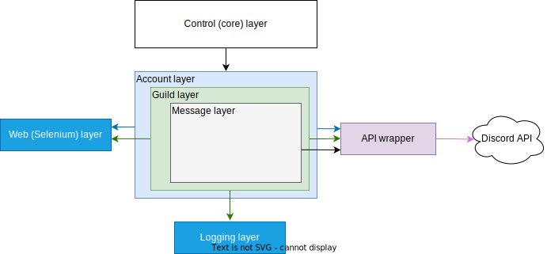

=====================================
Discord Advertisement Framework
=====================================

.. _Python: https://www.python.org

.. _DAFDOC: https://daf.davidhozic.com

.. |DAFDOC| replace:: DAF's documentation

.. note:: 
    
    The following document will refer to some objects that are found on external web documentation.
    Any links referencing functions/classes inside the project will open a page to |DAFDOC|_

.. figure:: ./DEP/images/logo.png
    :width: 3cm

    Discord Advertisement Framework logo
    (Made with DALL-E + Adobe Photoshop)

DAF Introduction
================================
Discord Advertisement Framework (from this point on, DAF) is a fully automatic shiller made part of the diploma.

It aims to eliminate the need of user presence while shilling is required.

I got the idea to make the project from a friend, who needed a way to automatically shill his NFT project.
The original project was just a simple script which was about 100 lines long, but since then the project has grown into a 
Python_ library consisting of ~5000 lines of original code.

The project's code is available on `Github <https://github.com/davidhozic/discord-advertisement-framework>`_.

The Python_ package is available on `PyPi (Python Package index) <https://pypi.org/project/Discord-Advert-Framework/>`_

The |DAFDOC|_ is available on https://daf.davidhozic.com .

It is important to mention that the framework itself is not a complete product, but rather half-product, which can
be quite quickly setup and thus turned into a full product with some very basic knowledge of the Python_ programming language.

Installation
================
DAF runs on Python_ so it is import that Python_ is installed on the machine.
DAF has been tested only on Windows and Linux, it is unknown how it works on Mac.

Once Python_ is installed, DAF can be installed with the following command:

.. code-block:: bash

    pip install discord-advert-framework

Basic usage
================
Once DAF is installed, users can create a Python_ script and start the framework with the :func:`daf.core.run` function which
accepts various parameters, the most important one being the ``accounts`` parameter which is a list of :class:`daf.client.ACCOUNT` instances.

The :class:`daf.client.ACCOUNT` accept different parameters the important ones being:

* token - The Discord's account authorization token
* is_user - Bool parameter that needs to be ``True`` if the ``token`` is from an user account.
* servers - A list of :class:`daf.guild.GUILD` / :class:`daf.guild.USER` that the user wants to shill too.

.. code-block::  python
    :caption: Example shilling script definition.
    :emphasize-lines: 6, 20

    from datetime import timedelta
    from daf import ACCOUNT, GUILD, USER, TextMESSAGE

    import daf

    accounts = [
        ACCOUNT(
            token="KSLKDJADNSJDBNAKDB", # Account token
            is_user=False,
            guilds=[
                GUILD(...), # First guild
                GUILD(...), # Second guild
                GUILD(...), # Third guild
                ...
            ]
        )
    ]

    # Start DAF
    daf.core.run(accounts=accounts)

The above :class:`daf.guild.GUILD` objects among others, accept 2 important parameters:

* snowflake - This is a universal identifier Discord uses on all their resources. Each resource has a unique ID.
* messages  - List of xMESSAGE instances which represent periodic messages that will be shilled into a server.

.. code-block:: python
    :caption: Example GUILD definition

    ...
    GUILD(
        snowflake=412098412094804,
        messages=[
            TextMESSAGE(...), # First message
            TextMESSAGE(...), # Second message
            TextMESSAGE(...), # Third message
            ...
        ]
    )
    ...

For sending direct messages to users :class:`daf.guild.USER` is used the same way.

The above :class:`daf.message.TextMESSAGE` objects accept the most parameters of all the classes available in DAF, but the only mandatory ones are:

* start_period - Accepts a :class:`datetime.timedelta` object which represents bottom range of a randomized shilling period. It can be None if fixed period is desired.
* end_period   - The same as start_period except it represents the upper range of the randomized period. If ``start_period`` is ``None``, the actual period is the same as end_period.
* data         - The data that is sent to Discord. It can in this case be:
    
  * :class:`str` - String (text) that is sent to the text channel.
  * :class:`discord.Embed` - API wrapper's object representing embedded messages. These are fancy formatted boxes with text, image, thumbnail, author, itd.
  * :class:`daf.dtypes.FILE` - Represents a file that is sent to Discord.
  * :class:`list` - List of any of the above types.
  * Special getter function for dynamically obtained (sent is what the function returns at individual call) data, see :func:`daf.dtypes.data_function` .

* channels - List of snowflakes which link to Discord channels where the shilling is required.

.. code-block:: python
    :caption: Example TextMESSAGE definition

    TextMESSAGE(
        start_period=timedelta(hours=2, minutes=30),
        end_period=timedelta(hours=4),
        data="Checkout my product!",
        channels=[314141234, 241421414124, 25152151512, 51251251512, ...]
    )

Once these has been defined the script is ready to use, simply run Python_ thru the console and pass the script file as the parameter.

The above shows how you can shill a constant textual content to a manually defined guild with manually defined text channels.
DAF also supports :class:`~daf.message.DirectMESSAGE`` for messaging users directly and :class:`~daf.message.VoiceMESSAGE`` for shilling audio content.

It also supports automatic guild definition based on regex and can join guilds automatically based on query parameter with :class:`~daf.guild.AutoGUILD` objects.
Channels can also be managed manually by using :class:`~daf.message.AutoCHANNEL` objects.
For more information about automatic shilling see :ref:`Automatic generation` .

Individual classes and function descriptions can be found on :ref:`Programming Reference` .

Additional guide is available on :ref:`Guide` .

Internals
=============
The following content describes how DAF works internally.

For DAF to work, it utilizes a build-in Python_ module called :mod:`asyncio`, which allows the application to asynchronous frameworks 
that utilize the await / async syntax ( since Python_ 3.5 - `PEP 492 <https://peps.python.org/pep-0492/>`_ ).

DAF can be represented with multiple abstraction layers:

- Selenium layer,
- Control layer (core),
- Account layer,
- Guild layer,
- Messages layer,
- Logging layer,
- API wrapper layer

    Abstraction

Selenium layer
-----------------

.. error:: **TODO:** NOT YET WRITTEN

Control layer
----------------
DAF can be controlled during it's runtime with the *control layer*, also called the core layer.

This layer is used to control the framework startups and shutdowns. It is also responsible for adding or removing objects from layers:

- Account layer,
- Guild layer,
- Message layer

Framework startup
^^^^^^^^^^^^^^^^^^
When the user calls :func:`daf.core.run` function, the first thing that happens is the creation of :mod:`asyncio`'s event loop which is the main mechanism behind switching coroutines.
After that a task is created for the :func:`daf.core.initialize` coroutine function which:

#. initializes the logging layer,
#. Initializes the accounts layer,
#. Calls the user given function passed to :func:`daf.core.run`.

Account layer
---------------
The account layer is responsible for managing accounts.

The account layer on each new account first makes a login attempt. 
If the attempt is successful it signals the guild layer to initialize all the given servers.
At the end it creates a shilling task for the related account.

Each account runs it's own shilling task to allow parallel shilling of multiple accounts at once. 
A single shilling task iterates all the servers the :class:`~daf.client.ACCOUNT` object has and signals the guild layer to check for ready
messages to be shilled. More than one shilling task would be redundant since Discord would simply start returning rate limit errors, thus removing any parallelism in each account.
Debatably 2 tasks would make sense since audio messages could be streamed while text messages are being sent without causing a rate limit, however having 2 tasks would require
some extra protection and possibly cause unpredictable code since they would share resources.
Using :class:`~asyncio.Lock`'s (mutexes) would solve unpredictable behavior, but would remove any parallelism.

.. raw:: latex

    \newpage

Guild layer
-------------
The guild layer is responsible for initializing the message layer and signaling 
the message layer to send messages to channels, whenever it detects a message is ready to be shilled.
It is also responsible for removing any messages that should be deleted, either by design or by critical errors
that require intervention.

The guild layer checks each message if it is to be removed, if not it creates coroutine objects for each message and then awaits
the coroutines which causes the message layer to shill each message to the belonging channels.

After each message send, the guild layer also signals the logging layer to make a log of the just now sent message.

.. error:: **TODO:** Guild layer diagram.

.. raw:: latex

    \newpage

Logging layer
---------------
The logging layer is responsible for saving message logs after getting data from the :ref:`Guild layer`.

Logging is handled thru logging manager objects and it supports 3 different logging schemes:

1. JSON logging - :class:`daf.logging.LoggerJSON`,
2. CSV logging (nested fields are JSON) - :class:`daf.logging.LoggerCSV` and
3. SQL logging (multiple dialects) - :class:`daf.logging.LoggerSQL`

.. figure:: ./DEP/source/guide/images/logging_process.drawio.svg
    :width: 300

    Logging layer flow diagram

Upon a logging request from the :ref:`Guild layer`, the logging layer obtains the globally set logging manager and calls
the method responsible for saving the log. If no exceptions are raised the logging layer stays silent.

In case of any exceptions, the logging layers traces the exception to the console, selects the backup (fallback) logging manager that is 
set by the manager's ``fallback`` parameter and repeats the process. It repeats this process until it runs out of fallbacks.

If it runs out of fallbacks, then the log will not be saved and an error will traced to the console notifying the user that
a log will not be saved.
