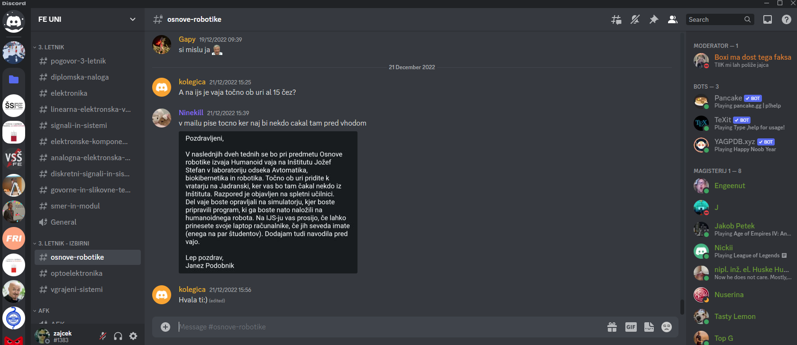
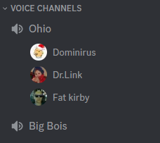
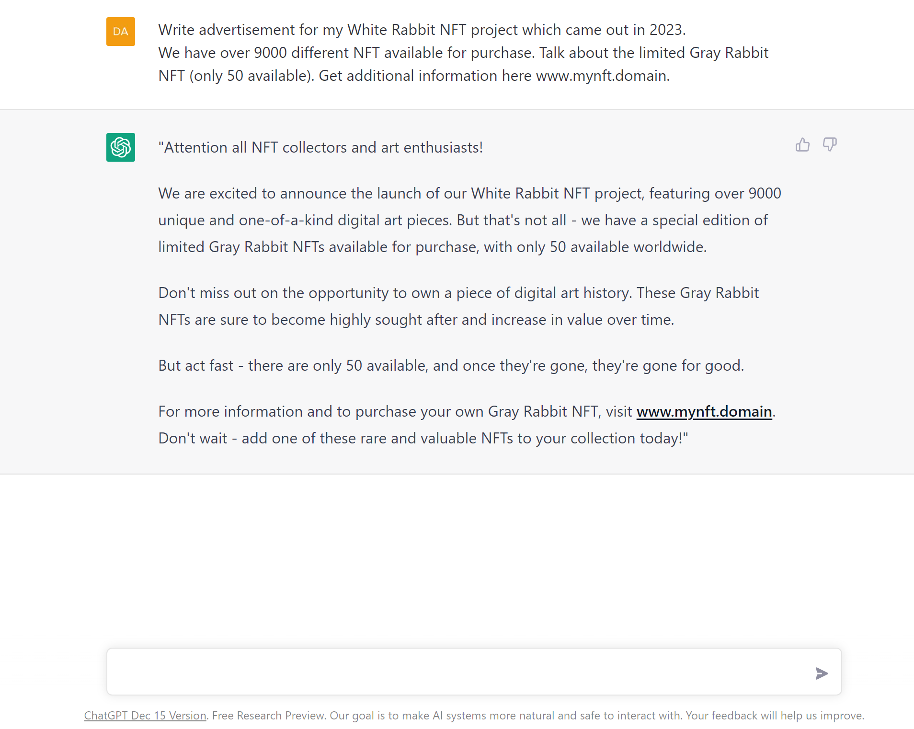

===================
Discord
===================

.. _`Developer mode`: https://support.discord.com/hc/en-us/articles/206346498-Where-can-I-find-my-User-Server-Message-ID-

.. _`API Reference`: https://discord.com/developers/docs/topics/opcodes-and-status-codes

The project focuses on Discord shilling and in order to understand the rest of the thesis, 
this chapter contains some background information on Discord, including how it came to be and some basic information on how it works.

What is Discord
==================
Discord was created in 2015 by Discord Inc (formerly known as Hammer & Chisel), a game development studio founded by Jason Citron and Stanislav Vishnevskiy.
The platform was designed as a communication tool for gamers, specifically as a way for players to communicate with each other while playing games online.

The idea for Discord came from Citron's personal experience as a gamer.
He noticed that many of the existing communication tools (Skype, TeamSpeak) for gamers were outdated and difficult to use,
and he wanted to create a more user-friendly platform that would allow players to easily communicate with each other while playing games.

Discord has since evolved beyond just being a communication tool for gamers and has become a popular platform for communities of all kinds to come together and communicate.
It is now used by millions of users around the world for everything from gaming to education to socializing.

Discord is a popular communication platform that allows users to communicate through voice, video, and text chat. 
It is utilized by millions of people, primarily aged 13 and up, to connect with their communities and friends. 
Discord is often used for a variety of purposes, including discussing art projects, planning family trips, seeking homework assistance, and providing mental health support.
It also has a good search feature for searching content that was once posted which is useful for eg. finding the due date of a diploma that someone posted a month ago.

While Discord can be a home for communities of any size, it is particularly popular among smaller, active groups that frequently communicate with one another.
The majority of Discord servers are private and require an invitation to join, providing a space for friends and communities to stay connected.
However, there are also larger, more public communities centered around specific topics, such as popular video games like Minecraft and Fortnite 
or in the case of this thesis, things like blockchain and NFT.
It can also be used as a community of a school / faculty where students can talk via the voice channels, share study materials
and ask questions about the material they are confused about.
Some examples of Discord communities related to University of Ljubljana:

- :ref:`Student council of Faculty of Electrical Engineering (ŠSFE) <ssfe-community-fig>`,
- :ref:`FE UNI <fe-uni-community-fig>` ,
- FE VSŠ,
- FRI UNI,
- ...

Users have the ability to control their interactions on Discord and customize their experience on the platform.
They can choose who they interact with and what topics they engage in conversations about.
This personalization is one of the reasons why Discord is so beloved by its users.
It allows them to be themselves and connect with others who share similar interests and hobbies.

.. figure:: images/discord_logo.svg
    :width: 400

    Discord brand

.. _ssfe-community-fig:
.. figure:: images/ssfe_discord.png
    :width: 400

    ŠSFE Discord community

.. _fe-uni-community-fig:

    FE UNI Discord community

.. raw:: latex

    \newpage

Discord structure
==================

.. figure:: images/discord_client_struct.drawio.png

    Client structure

The Discord client is the application you can use to communicate.
At the core it consists of direct messages button, guilds (servers) list, channels list, and members list inside the guild.
There are 2 types of members the guild can have:

1. Users
2. Bots - Accounts used for automation.

It is against Discord's terms of services to automate user accounts.

Server roles
--------------
Discord has a role based permission system which means that each guild (server) has little things called
roles and each role controls what permission users with a certain role will have. 
Roles can be useful for hiding certain channels, especially if there are a lot of channels in the server.
For example you have a school community with channels for each different class, you can have roles for
1st year, 2nd year students, and give the "View channel" permission of a 2nd year classes only to 2nd year students.

Text channels
---------------
Text channels in Discord are indicated by the # symbol and are used for text-based communication.
To use a text channel, you can select it from the left-hand panel of the Discord client to view its content.
To send a message to a text channel, enter your message in the text box at the bottom of the client and press Enter.
In addition to text, you can also send GIFs, stickers, emojis, and gifts through the text box.
You can interact with previously-sent messages in the text channel by adding reactions, creating threads, and replying directly to messages, depending on your permissions or roles in the server.

.. figure:: images/discord_text_channel.png

    Discord text channel

Voice channels
---------------
Voice channels are channels on a Discord server that allow users to communicate with each other via voice.
Users can join and leave voice channels as they please, and can also mute and deafen themselves if they don't want to listen to or be heard by others.
Most Discord servers have a default voice channel called "AFK" (Away From Keyboard) where users who are inactive or need to step away from their computer are automatically moved. This helps to reduce clutter and noise in other voice channels.
Some servers also have voice channels with specific purposes, such as a voice channel for music, or one for gaming.
Voice channels can be password protected, or can be set to allow anyone to join.
In a voice channel, users can also use text chat to communicate with each other.
Voice channels can be used for many different purposes, such as casual conversation, gaming, music listening, or even professional meetings.

    Discord voice channel

Direct messages
----------------
Discord's direct messages (DMs) are a convenient way to communicate privately with other users on the platform.
They allow users to send messages, share images and documents, and even voice and video call with one another and are very similar to :ref:`Text channels`.
DMs can be initiated by clicking on a user's profile or by mentioning them in a server.
They can be accessed from the main menu or from the user's contact list.
One of the great features of DMs is the ability to create group chats, allowing users to communicate with multiple people at once.
Discord also offers a "Do Not Disturb" mode, which allows users to silence their DMs while they are away or busy.
Overall, DMs are a valuable tool for connecting with friends and colleagues on Discord.

Shilling to Discord
==========================
Like explained in the :ref:`Shilling` chapter, shilling is a type of advertising.
It can be advertised to Discord either manually or automatically.

Manual shilling
---------------------
Manual shilling involves writing your advertisement, creating an account / accounts, finding the servers and then simply posting
into the channels that are meant for it or finding the users to DM about your product.

Generating shill content
^^^^^^^^^^^^^^^^^^^^^^^^^^
You can generate the advertisement content either manually from the top of your head, or
use some more sophisticated methods like AI. A great example of AI tools would be GPT-3 (Generative Pre-trained Transformer 3).

GPT-3 (Generative Pre-training Transformer 3) is a state-of-the-art artificial intelligence language model developed by OpenAI.
It has the ability to generate human-like text and perform a variety of tasks, such as translation, summarization, and question answering.
GPT-3 is the largest and most powerful language model to date, with a capacity of 175 billion parameters. 
It has garnered attention from both researchers and industry professionals due to its impressive capabilities and potential applications.

For reference, the above paragraph was written using Chat GPT.

To generate your advertisement content, you would, for example, pass GPT-3 with the following input:

*"Write advertisement for my White Rabbit NFT project which came out in 2023. 
We have over 9000 different NFT available for purchase. Talk about the limited Gray Rabbit NFT (only 50 available). Get additional information here www.mynft.domain"*

and it would generate: 

*"Attention all NFT collectors and art enthusiasts!
We are excited to announce the launch of our White Rabbit NFT project, featuring over 9000 unique and one-of-a-kind digital art pieces. But that's not all - we have a special edition of limited Gray Rabbit NFTs available for purchase, with only 50 available worldwide.
Don't miss out on the opportunity to own a piece of digital art history. These Gray Rabbit NFTs are sure to become highly sought after and increase in value over time.
But act fast - there are only 50 available, and once they're gone, they're gone for good.
For more information and to purchase your own Gray Rabbit NFT, visit www.mynft.domain. Don't wait - add one of these rare and valuable NFTs to your collection today!"*

Once you have the advertisement content, you would just copy and paste it to each channel.

    Chat GPT (GPT-3) example

Finding guilds to shill into
^^^^^^^^^^^^^^^^^^^^^^^^^^^^^^^^
Once you have your advertisement content, you need to find your guilds, that you want to shill into.
A good place to find the servers would be simply searching the web for websites that have a list of different
servers and allows searching for guilds by name / category.

A good example for finding guilds (servers), would actually be Discord itself, as they hold a list of certain servers, but for a server to be eligible 
for discovery on Discord, it needs to have at least 1000 members, meaning that the servers you can join directly from Discord's website, 
probably have some protection against shilling and they probably don't allow it.

Another, probably better, example would be website `Top.GG <https://top.gg>`_, which besides holding a list of servers,
also holds a list of public Discord bots, but that is not relevant for the purposes of this thesis.
Top.gg has a search bar with various parameters you can use to find your servers, to find NFT servers, it can be used
to simply search for "NFT".

After finding all the guilds, you would join all the guilds and find the channels appropriate to shill into
(without the owners kicking / banning you). These channels are usually named *shill, shilling, advertising, self-promo, ...*.

.. figure:: images/topgg_find_servers.png
    :width: 400

    Top.GG server discovery

